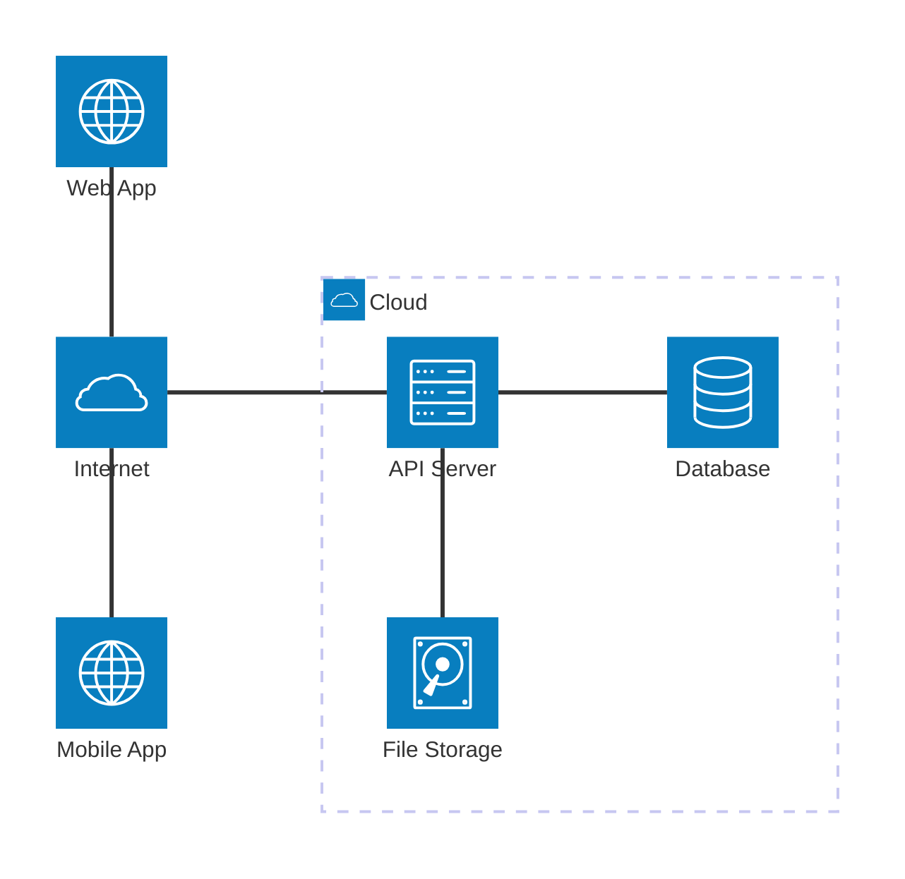
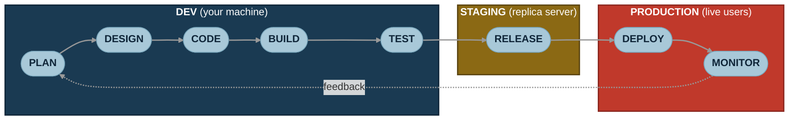
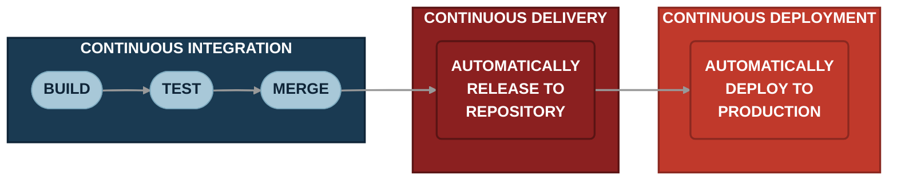
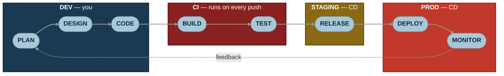

<h1 style="view-transition-name: deck-title">End to End Deployment</h1>

Part 1

---
src: ./part-1/presenter-introduction.md
---

---
---
# Welcome, new intern!
<!-- Congratulations! You've just been hired as new unpaid intern at Wrapper.ai, Singapore's premier AI B2B Web3 Agentic Deep Tech SaaS! -->

---
layout: section
---

## So, what does it mean to deploy an app?

---
---

# How do most apps work?

<AppSpectrum />

---
layout: two-cols-header
---

# The Client-Server model

Your app (the **client**) talks to a **server** over the internet.

::left::

::right::

- **Client**: the browser tab or mobile app the user sees
- **Internet**: how the client reaches your server
- **API Server**: runs your backend code and exposes an API (e.g Hono, Express, FastAPI)
- **Database**: structured state (e.g PostgreSQL, MongoDB)
- **File Storage**: blobs like images, PDFs, videos (e.g S3)

---
layout: image
image: ./the-cloud.png
backgroundSize: contain
---

---
---

# Deployment Environments
<!-- todo make the deployment slides better -->
## Dev
- Your computer!
- Your working copy of the code
- Uses simulated data

---
---
# Deployment Environments
## Staging
- A replica of the production environment
- Located on a remote server
- A sandbox environment for testing new features before deploying

---
---
# Deployment Environments
## Production
- The live, public version of your app
- Located on a remote server
- What the end users see

---
layout: section
---
## How code gets to production

---
---
# The software development lifecycle
<!-- lifecycle from dev to production -->

- A repeating cycle, not a one-shot project
- Each phase happens in a specific environment: **dev → staging → prod**
- Bugs caught earlier (in dev or staging) are cheaper than bugs in prod

---
---
# CI/CD
- Objective: streamline the deployment process to minimise human intervention
- Continuous Integration (CI): automation of building and testing
- Continuous Delivery/Deployment (CD): automation of deploying to production
- Commonly used tools: Jenkins, GitLab CI, GitHub Actions

---
---
# How CI/CD fits into the software development lifecycle

- **You** plan, design, and code on your **dev** machine
- **CI** runs build & test on every push
- **CD** ships to **staging** automatically, then to **prod** on merge
- Each environment is a checkpoint: dev → staging → prod

---
layout: quote
---
# But boss, it works on my machine! 

---
layout: two-cols-header
---
# Containerisation
::left::
- Packages the application, its dependencies, and the runtime environment into a single container
- Runs the container on any machine with a compatible runtime
- More portable, easier to deploy, and less resource-intensive than virtual machines
- Going to go more in depth next week!
::right::

---
layout: two-cols-header
---
# Going "Serverless"

::left::
- You supply the code, the platform handles the environment
- Pros: 
  - no need to manage infrastructure
  - easy scaling
- Cons:
  - no control over the environment
  - vendor lock-in
- e.g AWS Lambda, Firebase Functions

::right::

---
layout: section
---
## Cloudflare
We're not sponsored btw

---
---
# Bing shilling time
- Cloudflare is
  - cheap
  - fast
  - easy
- We're going to use the following:
  - Cloudflare Workers (serverless!)
  - Cloudflare R2 (file storage!)
- They have way too many services to list here