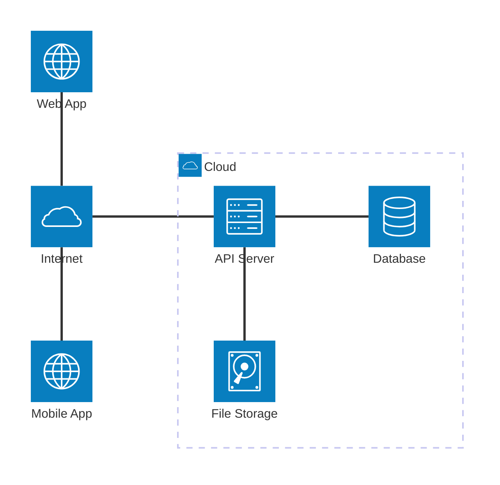
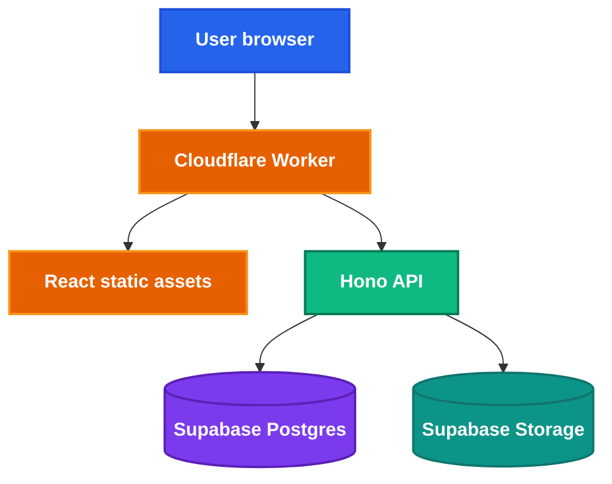
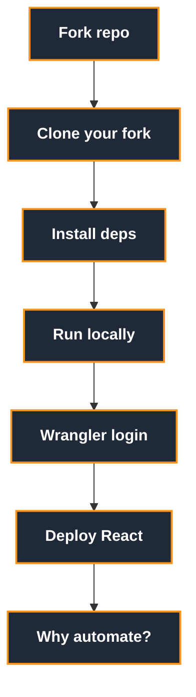
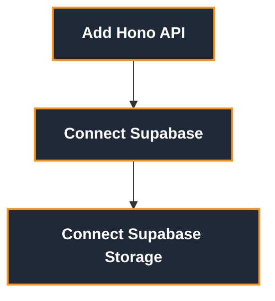
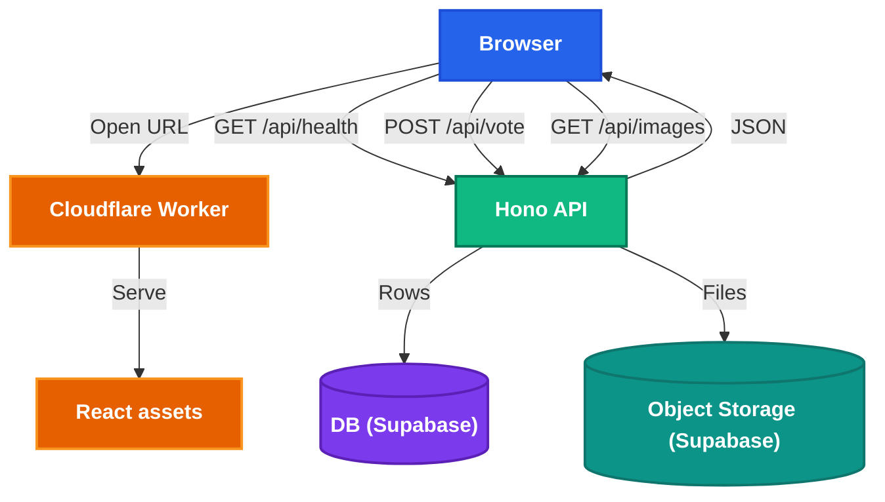

<h1 style="view-transition-name: deck-title">End to End Deployment</h1>

Part 1: From localhost to the internet

<!--
Welcome everyone to the Orbital deployment workshop! I'm excited to have you here.

This is Part 1 of a two-part series. Today we go from localhost to a live URL on the internet. Next session, we'll automate that process with CI/CD and containers.

By the end of today, you'll have a real, publicly accessible app — not just something running on your laptop.

[~1 min]
-->

---
src: ./part-1/presenter-introduction.md
---

---
layout: section
---

## Today, let's make your app real!

<!--
So here's the thing — a lot of you have already built or started building your Orbital projects. You've got code, you've got features, maybe a nice frontend.

But right now it only runs on your machine. And that's fine for development. But at some point, your advisor, your teammates, your users — they need to actually use it.

That's what today is about. We're going to take something that works on localhost and put it on the internet for real.

[~1 min]
-->

---
layout: center
class: text-center
---

# So... you built something.


<!--
Raise your hand if you've ever sent a localhost link to someone. Maybe in a group chat, maybe in a message. "Hey check this out" — and it just doesn't work for them.

This is actually one of the most common beginner mistakes when you first start doing web dev. You send localhost:5173 and your teammate opens it and gets... nothing. A blank page. Connection refused.

Why? Let's break that down.

[~1 min]
-->

---
layout: two-cols-header
class: compact media-heavy laptop-as-server-slide
---

# Why did the link fail?

::left::

<LaptopAsServer />

::right::

## Your teammate opens it

- Their `localhost` means **their laptop**
- Nothing is listening on port `5173`
- Your dev server is not on the public internet
- So the link only works on your machine

<!--
So when you type localhost:5173 in your browser, what's actually happening?

"localhost" is a special hostname that always means "this machine." It resolves to 127.0.0.1, which is a loopback address — your computer talking to itself.

The :5173 part is the port number — it says which program on your machine to talk to. In this case, that's your Vite dev server.

So when you send that link to your teammate, their browser resolves "localhost" to THEIR machine. It asks THEIR machine for port 5173. And nothing is listening there. Hence, connection refused.

Your dev server is not on the public internet. It's only listening on your machine's loopback interface.

[~2 min]
-->

---

# How do most apps work?

<AppSpectrum />

<!--
So now the question becomes: how much of your app actually needs to be "on the internet"?

It depends on what you're building. Some apps are fully offline — they don't need a server at all. Some need a persistent connection to a backend. Most fall somewhere in between.

Let me show you a few examples across this spectrum so you get a feel for it.

[~1 min]
-->

---
layout: two-cols-header
class: compact diagram-heavy
---

# Deployment can mean distribution

::left::

<div class="mt-6 flex items-center justify-center gap-2 text-center">
  <div v-click class="rounded-[8px] border border-[var(--nus-border)] bg-[var(--nus-surface)] p-3 shadow-[var(--nus-shadow)]">
    
    <div class="mt-2 text-sm font-semibold">Calculator app</div>
    <div class="nus-token-faint mt-1 text-[0.68rem]">Logic runs on-device</div>
  </div>
  <div v-click class="nus-token-accent text-2xl font-bold">&rarr;</div>
  <div v-click class="rounded-[8px] border border-[var(--nus-border)] bg-[var(--nus-surface)] p-3 shadow-[var(--nus-shadow)]">
    <div class="mx-auto grid h-14 w-14 place-items-center rounded-[12px] bg-[color-mix(in_srgb,var(--nus-accent),transparent_82%)] text-xl font-bold text-[var(--nus-accent)]">.apk</div>
    <div class="mt-2 text-sm font-semibold">Build artifact</div>
    <div class="nus-token-faint mt-1 text-[0.68rem]">Signed package</div>
  </div>
  <div v-click class="nus-token-accent text-2xl font-bold">&rarr;</div>
  <div v-click class="rounded-[8px] border border-[var(--nus-border)] bg-[var(--nus-surface)] p-3 shadow-[var(--nus-shadow)]">
    
    <div class="mt-2 text-sm font-semibold">Store install</div>
    <div class="nus-token-faint mt-1 text-[0.68rem]">App Store, Play Store, direct</div>
  </div>
</div>

::right::

<v-clicks>

## Fully offline

- No API server
- No database in the cloud
- No process to keep running
- Production is the version users have installed

</v-clicks>

<!--
On the fully offline end, think of something like a calculator app. There's no server. All the logic runs on the user's device. You build it, package it into an APK or IPA, and distribute it through an app store.

Deployment here means: what artifact do users install, and how do updates reach them? The answer is the app store. You push a new version, users update, done.

This is the simplest deployment model. No server to keep running, no database to manage. But obviously, it limits what your app can do — no shared state, no real-time features.

[~2 min]
-->

---
layout: two-cols-header
class: compact diagram-heavy
---

# Deployment can mean hosting a world

::left::

<div class="mt-2 grid grid-cols-[1.05fr_auto_1.05fr_auto_1.1fr] items-center gap-2 text-center text-[0.66rem] leading-tight">
  <div v-click class="rounded-[8px] border border-[var(--nus-border)] bg-[var(--nus-surface)] p-2 shadow-[var(--nus-shadow)]">
    
    <div class="mt-1 font-semibold">Launcher</div>
    <div class="nus-token-faint mt-0.5">Installs, updates, signs in</div>
  </div>
  <div v-click class="nus-token-accent text-xl font-bold">&rarr;</div>
  <div v-click class="rounded-[8px] border border-[var(--nus-border)] bg-[var(--nus-surface)] p-2 shadow-[var(--nus-shadow)]">
    
    <div class="mt-1 font-semibold">Client</div>
    <div class="nus-token-faint mt-0.5">Runs on player's device</div>
  </div>
  <div v-click class="nus-token-accent text-xl font-bold">&harr;</div>
  <div v-click class="rounded-[8px] border border-[var(--nus-border)] bg-[var(--nus-surface)] p-2 shadow-[var(--nus-shadow)]">
    
    <div class="mt-1 font-semibold">Server</div>
    <div class="nus-token-faint mt-0.5">Runs somewhere reachable</div>
  </div>

  <div v-click class="col-span-5 grid grid-cols-[1fr_auto_1fr] items-center gap-2">
    <div class="rounded-[8px] border border-[var(--nus-border)] bg-[var(--nus-surface)] px-3 py-2 shadow-[var(--nus-shadow)]">
      <div class="font-semibold text-[var(--nus-accent)]">Microsoft account</div>
      <div class="nus-token-faint mt-0.5">Java Edition identity</div>
    </div>
    <div class="nus-token-muted text-lg">&rarr;</div>
    <div class="rounded-[8px] border border-[var(--nus-border)] bg-[var(--nus-surface)] px-3 py-2 shadow-[var(--nus-shadow)]">
      <div class="font-semibold text-[var(--nus-success)]">Online-mode check</div>
      <div class="nus-token-faint mt-0.5">Server verifies players</div>
    </div>
  </div>

  <div v-click class="col-span-5 rounded-[8px] border border-[var(--nus-border)] bg-[color-mix(in_srgb,var(--nus-warning),transparent_90%)] px-3 py-2 text-left shadow-[var(--nus-shadow)]">
    <div class="font-semibold text-[var(--nus-warning)]">Deployed game server</div>
    <div class="nus-token-faint mt-0.5">Owns the shared world state, for example blocks, mobs, inventories, and player positions.</div>
  </div>
</div>

::right::

<v-clicks>

## Multiplayer changes the deployment

- Single-player worlds can live on your device
- Multiplayer needs a reachable server
- Clients send actions and receive world updates
- The server decides the shared truth

</v-clicks>

<!--
Now let's go to the other extreme. Minecraft is a great example because most of you have probably played it.

Single-player Minecraft is basically offline — the world lives on your hard drive. But multiplayer Minecraft? That's a completely different deployment story.

You need a server running somewhere that multiple clients can connect to. That server owns the shared world state — it's the source of truth for blocks, mobs, inventories, everything. The clients send actions ("I broke this block") and receive updates ("here's what the world looks like now").

The deployment question here is: where is the server running, and can players reach it reliably? If the server goes down, everyone gets kicked. If it's laggy, everyone suffers.

Some of your Orbital projects might look like this — any time you have real-time shared state, you're in this territory.

[~2 min]
-->

---
layout: two-cols-header
class: compact diagram-heavy
---

# Deployment can mean client plus cloud

::left::

<div class="mt-5 grid grid-cols-[1fr_auto_1.1fr] items-center gap-4 text-center text-[0.78rem]">
  <div class="space-y-3">
    <div v-click class="rounded-[8px] border border-[var(--nus-border)] bg-[var(--nus-surface)] p-3 shadow-[var(--nus-shadow)]">
      
      <div class="mt-2 font-semibold">Mobile app</div>
      <div class="nus-token-faint mt-1">Installed by users</div>
    </div>
    <div v-click class="rounded-[8px] border border-[var(--nus-border)] bg-[var(--nus-surface)] p-3 shadow-[var(--nus-shadow)]">
      
      <div class="mt-2 font-semibold">Web app</div>
      <div class="nus-token-faint mt-1">Loaded in browser</div>
    </div>
  </div>
  <div v-click class="nus-token-accent text-3xl font-bold">&rarr;</div>
  <div v-click class="rounded-[8px] border border-[var(--nus-border)] bg-[var(--nus-surface)] p-3 shadow-[var(--nus-shadow)]">
    <div class="mx-auto grid h-14 w-14 place-items-center rounded-[10px] bg-[color-mix(in_srgb,var(--nus-success),transparent_82%)] text-xl font-bold text-[var(--nus-success)]">API</div>
    <div class="mt-2 text-base font-semibold">Backend services</div>
    <div class="mt-3 grid grid-cols-[minmax(0,1fr)_minmax(0,1.25fr)] gap-2 text-[0.68rem]">
      <div class="rounded-[8px] border border-[var(--nus-border)] px-1.5 py-1">Accounts</div>
      <div class="rounded-[8px] border border-[var(--nus-border)] px-1.5 py-1">Bookings</div>
      <div class="rounded-[8px] border border-[var(--nus-border)] px-1.5 py-1">Payments</div>
      <div class="rounded-[8px] border border-[var(--nus-border)] px-1.5 py-1">Maps</div>
      <div class="rounded-[8px] border border-[var(--nus-border)] px-1.5 py-1">Database</div>
      <div class="rounded-[8px] border border-[var(--nus-border)] px-1.5 py-1">Notifications</div>
    </div>
  </div>
</div>

::right::

<v-clicks>

## Two things get shipped

- The app store ships the mobile client
- Web hosting ships the browser client
- Backend deployment ships live data and behavior
- You can update the backend without asking users to reinstall

</v-clicks>

<!--
And then there's the model most of you are probably building for Orbital — something like Grab or any modern SaaS app.

You have a client — could be a mobile app, could be a web app, could be both. And you have backend services in the cloud handling accounts, data, payments, notifications, whatever.

The key insight here is that you're shipping TWO things. The app store ships the mobile client. Web hosting ships the browser client. And then separately, your backend deployment ships the live data and behavior.

One huge advantage: you can update the backend without asking users to reinstall anything. You push a new API version, and everyone gets the new behavior immediately.

Most Orbital projects fall somewhere in this space — a frontend plus an API plus a database. And that's exactly what we're going to deploy today.

[~2 min]
-->

---
layout: two-cols-header
class: diagram-heavy compact
---

# The client-server model

Most apps work like this:

Your app, the **client** (running on the user's device), talks to a **server** over the internet.

::left::



::right::

- **Client**: the browser tab or mobile/desktop app the user sees
- **Internet**: how the client reaches your server
- **API server**: runs backend code, for example Hono, Express, FastAPI
- **Database**: structured state, for example users, posts, events
- **File storage**: blobs like images, PDFs, videos

<!--
So let's formalize this. Most web apps follow a client-server model. This diagram is going to be the mental model you come back to over and over.

On the left, you have clients — that's the browser or the mobile app. On the right, you have backend services running in the cloud: an API server, a database, and file storage.

The client makes requests over the internet — usually HTTP requests — to the API server. The API server talks to the database for structured data like user accounts or posts. And it talks to file storage for things like images or PDFs.

For Orbital, your stack probably maps directly onto this. You have a React or Vue or Flutter frontend, some kind of API layer, and a database. Today we'll deploy all three of those pieces.

[~2 min]
-->

---
layout: two-cols-header
---

# To production and beyond!


::left::

## Local

A local server is great for development.

- It lets you test changes immediately.

- You can break things without affecting others.

But... you can't expect everyone to have your laptop.


::right::

## Production

Our ultimate goal is to deploy to a production environment.

A production environment:

- is where the latest stable version of your app runs
- is accessible to everyone, not just you
- requires higher standards of quality and reliability

<!--
So we have two worlds. On the left: local development. This is where you've been living. You run `npm run dev`, you see changes instantly, and if something breaks, no one cares except you.

On the right: production. This is where your app actually lives for real users. It needs to be accessible to everyone, it needs to be running the latest stable version, and it needs to be reliable.

The gap between these two worlds is what deployment bridges. Today, we're going to cross that gap.

[~1 min]
-->


---
layout: section
---

## What does it mean to deploy to production?

<!--
With that said, what does it actually mean to deploy to production? You hear people say "ship it" or "deploy it" all the time. But what's actually happening under the hood?

Let's start with the most basic question: where does your code actually run?

[~30 sec]
-->

---
layout: image
image: /the-cloud.webp
backgroundSize: contain
---

<!--
"The cloud" — it's just someone else's computer. That's the joke, and it's mostly true.

When you deploy to the cloud, your code runs on physical machines in data centers owned by companies like Amazon, Google, or Cloudflare. You don't see the hardware, you don't manage the hardware, but it's real hardware running in a building somewhere.

The magic of cloud computing is that you get to pretend the hardware doesn't exist. You just say "run my code" and it runs. But someone is paying for that hardware, and the choices you make about WHERE and HOW you deploy affect cost, performance, and reliability.

[~1 min]
-->

---

# So whose computer is it?

- Big cloud providers (Infrastructure as a Service): AWS, Google Cloud, Azure
- Developer platforms (Platform as a Service): Cloudflare, Vercel, Netlify, Render, Fly.io
- Backend platforms (Backend as a Service): Supabase, Firebase, Neon

<!--
So whose computer is it? There's a spectrum here.

At the top, you have the big cloud providers — AWS, Google Cloud, Azure. These are Infrastructure as a Service. They give you raw building blocks: virtual machines, networks, storage. You get maximum control, but you also manage everything yourself. Think of it like renting an empty warehouse — you bring your own furniture.

In the middle, developer platforms like Cloudflare, Vercel, Netlify, Render. These are Platform as a Service. They handle the infrastructure and give you a nice developer experience. You push code, they handle the rest. Think of it like a co-working space — the desks are already there.

And then Backend as a Service — Supabase, Firebase, Neon. These give you pre-built backend components: databases, auth, storage. You don't write server code for those parts at all.

The tradeoff: more managed means faster to build but more tied to a specific ecosystem. For Orbital, developer platforms and BaaS are usually the sweet spot — you can ship fast without drowning in infrastructure.

[~3 min]
-->

---

# Deployment environments


| Environment | Where it runs | Who uses it | What it is for |
| --- | --- | --- | --- |
| Local | Your computer | You | Building and debugging |
| Staging | Cloud server | Your team | Testing before release |
| Production | Cloud server | Real users | The live app |

We'll skip the staging environment in this workshop (and frankly, you probably don't need it for Orbital), but the tl;dr is: it's a copy of the production environment, minus the live users.

<!--
Before we get into the "how", let's get on the same page about the "where".

When we talk about running your app, there are three environments you'll hear about constantly. The first is local — this is just your laptop. You're the only one who can see it, and it's where you spend most of your time building and fixing things.

Then there's staging, which is a cloud server that mirrors production but isn't open to real users. It's basically a dress rehearsal. Your team can test things there before they go live.

And finally, production — the real deal. This is the cloud server your actual users hit when they open your app.

Now, for Orbital, you realistically only need two of these: local and production. Staging is a nice-to-have, but it adds complexity you probably don't need yet. So for this workshop, we're going to focus on getting you from local to production.
-->

---
class: diagram-heavy compact
---

# Where deployment fits

From your laptop to production

<div class="flex justify-center mt-2">


</div>
Software Development Life Cycle (SDLC)

<!--
This is the Software Development Life Cycle, or SDLC. You've probably seen variations of this before.

On the left is your development machine — where you plan, design, code, build, and test. In the middle is an optional staging environment for final testing. On the right is production, where you deploy and then monitor.

Notice the feedback loop from monitor back to plan. That's the cycle — you deploy, you see how it behaves in the real world, you learn, and you go back to improve.

Today we're zooming into the build-to-deploy part of this pipeline. We're going to manually walk through those steps so you understand what's happening. In Session 2, we'll automate this entire path with CI/CD.

[~2 min]
-->

---
class: compact
---

# How do you deploy?

<!-- Same goal: get your app to users. The difference is how much infrastructure **you** manage. -->

<div class="mt-10">
  <div class="mb-2 flex justify-between text-[0.72rem] font-semibold nus-token-faint">
    <span>You manage more</span>
    <span>Platform manages more</span>
  </div>
  <div class="relative h-2.5 overflow-hidden rounded-full border border-[var(--nus-border)] bg-[var(--nus-code-bg)]">
    <div class="absolute inset-0 bg-gradient-to-r from-transparent via-[color-mix(in_srgb,var(--nus-accent),transparent_55%)] to-[var(--nus-accent-soft)]"></div>
  </div>
  <div class="mt-5 grid grid-cols-3 gap-3 text-center text-[0.78rem]">
    <div v-click class="rounded-[8px] border border-[var(--nus-border)] bg-[var(--nus-surface)] px-3 py-3 shadow-[var(--nus-shadow)]">
      <div class="font-bold text-[var(--nus-text)]">Traditional server</div>
      <div class="nus-token-faint mt-1">Long-lived process on a machine you control</div>
    </div>
    <div v-click class="rounded-[8px] border border-[var(--nus-border)] bg-[var(--nus-surface)] px-3 py-3 shadow-[var(--nus-shadow)]">
      <div class="font-bold text-[var(--nus-text)]">Container platforms</div>
      <div class="nus-token-faint mt-1">You ship an image; the platform or cluster runs it</div>
    </div>
    <div v-click class="rounded-[8px] border border-[var(--nus-border)] bg-[var(--nus-surface)] px-3 py-3 shadow-[var(--nus-shadow)]">
      <div class="font-bold text-[var(--nus-text)]">Serverless functions</div>
      <div class="nus-token-faint mt-1">You ship handlers; the platform owns the runtime</div>
    </div>
  </div>
  <div v-click class="mt-4 rounded-[8px] border border-dashed border-[var(--nus-border)] bg-[color-mix(in_srgb,var(--nus-accent),transparent_92%)] px-4 py-3 text-center text-[0.8rem]">
    <span class="font-bold text-[var(--nus-accent)]">Static hosting</span>
    <span class="nus-token-muted">:  no server process; built files on a CDN (Netlify, Vercel, Cloudflare Pages)</span>
  </div>
</div>

<!--
So how do you actually deploy? There's a spectrum here based on how much infrastructure you manage yourself.

On the left: traditional servers. You rent or own a machine, you install your app, you keep it running. Maximum control, maximum responsibility. You're responsible for security patches, scaling, uptime — everything.

In the middle: containers. You package your app and all its dependencies into a container image. Then you hand that image to a platform like Cloud Run or Kubernetes, and it runs it for you. You still decide what goes in the container, but the platform manages the underlying machines.

On the right: serverless. You just write functions or route handlers. The platform owns the entire runtime — it starts your code when a request comes in, scales it when traffic increases, and shuts it down when it's idle.

An important nuance: containers and serverless are not opposites. A container is a packaging format — it answers "what do we ship?" Serverless is an operating model — it answers "who manages the runtime?" Cloud Run, for example, combines both: you ship a container, but the platform operates it in a serverless way.

At the bottom, static hosting is a separate thing entirely — no server process at all. You build your frontend files and put them on a CDN.

[~3 min]
-->

---
class: compact
---

# Types of deployment

<p class="nus-token-faint -mt-2 mb-0 text-[0.88rem]">Four common ways to put your app on the internet</p>

<div class="mt-3 grid grid-cols-2 gap-3">
  <div v-click class="rounded-[10px] border border-[var(--nus-border)] bg-[var(--nus-surface)] p-3 shadow-[var(--nus-shadow)]">
    <h2 class="!mb-1.5 !text-[1.12rem]">Static hosting</h2>
    <ul class="!gap-1">
      <li>Serves built HTML, CSS, JS, and assets</li>
      <li>Great for frontend-only apps</li>
    </ul>
    <div class="mt-2 flex flex-wrap gap-1.5 text-[0.65rem] font-semibold">
      <span class="rounded border border-[var(--nus-border)] px-2 py-0.5 text-[var(--nus-accent)]">Netlify</span>
      <span class="rounded border border-[var(--nus-border)] px-2 py-0.5 text-[var(--nus-accent)]">Vercel</span>
      <span class="rounded border border-[var(--nus-border)] px-2 py-0.5 text-[var(--nus-accent)]">Cloudflare Pages</span>
    </div>
  </div>
  <div v-click class="rounded-[10px] border border-[var(--nus-border)] bg-[var(--nus-surface)] p-3 shadow-[var(--nus-shadow)]">
    <h2 class="!mb-1.5 !text-[1.12rem]">Traditional server</h2>
    <ul class="!gap-1">
      <li>You run a long-lived process</li>
      <li>You manage the machine or platform</li>
    </ul>
    <div class="mt-2 flex flex-wrap gap-1.5 text-[0.65rem] font-semibold">
      <span class="rounded border border-[var(--nus-border)] px-2 py-0.5 text-[var(--nus-accent)]">VPS</span>
      <span class="rounded border border-[var(--nus-border)] px-2 py-0.5 text-[var(--nus-accent)]">EC2</span>
      <span class="rounded border border-[var(--nus-border)] px-2 py-0.5 text-[var(--nus-accent)]">Render</span>
    </div>
  </div>
  <div v-click class="rounded-[10px] border border-[var(--nus-border)] bg-[var(--nus-surface)] p-3 shadow-[var(--nus-shadow)]">
    <h2 class="!mb-1.5 !text-[1.12rem]">Containerized services</h2>
    <ul class="!gap-1">
      <li>Package app, dependencies, and runtime into an image</li>
      <li>Can run on your own infra or a managed platform</li>
    </ul>
    <div class="mt-2 flex flex-wrap gap-1.5 text-[0.65rem] font-semibold">
      <span class="rounded border border-[var(--nus-border)] px-2 py-0.5 text-[var(--nus-accent)]">Docker</span>
      <span class="rounded border border-[var(--nus-border)] px-2 py-0.5 text-[var(--nus-accent)]">Cloud Run</span>
      <span class="rounded border border-[var(--nus-border)] px-2 py-0.5 text-[var(--nus-accent)]">Fly.io</span>
      <span class="rounded border border-[var(--nus-border)] px-2 py-0.5 text-[var(--nus-accent)]">ECS</span>
      <span class="rounded border border-[var(--nus-border)] px-2 py-0.5 text-[var(--nus-accent)]">Kubernetes</span>
    </div>
  </div>
  <div v-click class="rounded-[10px] border border-[var(--nus-border)] bg-[var(--nus-surface)] p-3 shadow-[var(--nus-shadow)]">
    <h2 class="!mb-1.5 !text-[1.12rem]">Serverless functions & workers</h2>
    <ul class="!gap-1">
      <li>You ship functions, workers, or route handlers</li>
      <li>Provider runtime handles startup, scaling, and requests</li>
    </ul>
    <div class="mt-2 flex flex-wrap gap-1.5 text-[0.65rem] font-semibold">
      <span class="rounded border border-[var(--nus-border)] px-2 py-0.5 text-[var(--nus-accent)]">Cloudflare Workers</span>
      <span class="rounded border border-[var(--nus-border)] px-2 py-0.5 text-[var(--nus-accent)]">AWS Lambda</span>
      <span class="rounded border border-[var(--nus-border)] px-2 py-0.5 text-[var(--nus-accent)]">Vercel Functions</span>
    </div>
  </div>
</div>

<!--
Let me walk through each one quickly.

Static hosting — this is the simplest. You build your React app into HTML, CSS, and JS files, and a platform like Netlify or Vercel serves them from a CDN. No server process runs. Great for frontend-only apps, but you can't handle any backend logic.

Traditional server — you have a process running 24/7. Maybe it's a Node.js Express server on a VPS. You control everything, but you're also responsible for keeping it alive, patching it, and scaling it.

Containerized services — you package everything into a Docker image. That image runs the same way everywhere. Docker, Cloud Run, Fly.io, ECS, Kubernetes — these all run containers.

Serverless functions and workers — you write just the handler code, and the platform runs it for you. Cloudflare Workers, AWS Lambda, Vercel Functions. No server to manage. This is what we'll use today.

For this workshop, we're using Cloudflare Workers as our serverless platform. It's fast, the free tier is generous, and it can serve both our frontend and API.

[~3 min]
-->

---
layout: two-cols-header
---

# Containerisation

::left::

- Packages the application, dependencies, and runtime into one container image
- Helps avoid "it works on my machine" environment drift
- Useful when you need a custom runtime or long-running service
- We will go deeper next session

::right::


<!--
Containerisation is a big topic, so I'm just going to touch on it briefly here. The core idea is that you package your application, its dependencies, and its runtime into a single image. That image runs the same way regardless of where you deploy it.

This solves the classic "it works on my machine" problem. If it runs in the container on your laptop, it'll run the same way in production.

We're going to go much deeper into containers in the next session when we cover Docker. For now, just know that this is one of the main ways people ship backend services, and it sits in the middle of the management spectrum.

[~1.5 min]
-->

---
layout: two-cols-header
---

# Serverless still uses servers

::left::

- You supply code
- The platform supplies the runtime
- The platform handles scaling, patching, and capacity
- You usually pay for requests or usage, not idle machines

::right::


<!--
"Serverless" is a bit of a misnomer — there are definitely still servers involved. You just don't manage them.

The deal is: you write code, the platform handles everything else. The runtime, the scaling, the patching, the capacity planning. You pay for what you use — requests, compute time, bandwidth — rather than paying for a machine that sits idle at 3 AM.

Within serverless, you can roughly split things into Functions as a Service (like AWS Lambda) where you write individual functions, and Containers as a Service (like Cloud Run) where you ship a container but the platform still manages it serverlessly.

For Cloudflare Workers, which is what we'll use today, it's more like Functions as a Service. You write a request handler, deploy it, and Cloudflare runs it at the edge — meaning your code executes in data centers close to your users, not in one central location.

[~2 min]
-->

---
---

# Serverless tradeoffs

<div class="grid grid-cols-2 gap-8 mt-8">
<div>

## Nice

- Low setup cost
- Scales without much planning
- No server maintenance
- Good fit for small student projects

</div>
<div>

## Watch out

- Platform-specific APIs
- Runtime limits
- Cold starts on some providers
- Debugging can feel different from local dev

</div>
</div>

<!--
Let's be honest about the tradeoffs because there's no free lunch.

On the nice side: serverless is incredibly fast to get started with. You don't need to provision servers, you don't need to worry about scaling — it just handles it. And for student projects with bursty traffic, the pay-per-use model is very friendly. Your app can sit idle for days and cost you nothing.

But watch out: you're writing code for a specific platform's runtime. Cloudflare Workers use V8 isolates, not Node.js. AWS Lambda has cold starts. Vercel Functions have execution time limits. And debugging in production can feel quite different from debugging locally because the runtime environment is different.

For Orbital-scale projects, the benefits usually far outweigh the downsides. But it's worth knowing what you're trading off.

[~2 min]
-->

---
class: diagram-heavy compact
---

# What we are building today

<div class="flex justify-center mt-4">



</div>

<!--
Here's the architecture we're building today. Let me walk you through it.

At the top, a user opens their browser. The request hits a Cloudflare Worker. The Worker does two things: it serves the React static assets — that's your frontend — and it runs a Hono API.

Hono is a tiny, fast web framework designed for edge runtimes like Workers. It's like Express but much smaller and built for this environment.

The Hono API talks to Supabase for two things: Postgres for structured data, and Supabase Storage for files like images.

So in total, we're deploying: a frontend (React), a backend (Hono on Workers), a database (Supabase Postgres), and file storage (Supabase Storage). That's a real full-stack app.

[~2 min]
-->

---
layout: section
---

## Let's deploy our app!

<!--
Alright, enough theory! Let's actually do it. From this point on, we're going hands-on.

I'm going to walk through each step, and you should follow along on your own machines. If you get stuck at any point, raise your hand or drop a message — we'll help you out.

[~30 sec]
-->

---
layout: section
---

## Cloudflare

We're not sponsored btw

<!--
So we're going to use Cloudflare for this workshop. And no, we're not sponsored — I just think it's a genuinely good choice for what we're doing today.

Let me explain why we picked Cloudflare over other options.

[~15 sec]
-->

---
---

# Why Cloudflare for this workshop?

- Workers let us deploy backend code without managing a server
- Workers can also serve our built React app
- Supabase gives us Postgres + file storage in one platform
- The free tiers are friendly for demos and student projects
- You do not need to buy a domain today

<!--
Why Cloudflare? A few reasons.

First, Workers let us deploy backend code without managing any servers. No EC2 instances, no Docker, no VPS. Just push code and it runs.

Second, Workers can serve both our API and our built React app from the same deployment. That means one deploy gives us a full-stack app.

Third, we're pairing it with Supabase for database and file storage. Supabase gives us hosted Postgres and a Storage API in one platform, with a generous free tier.

And critically for a workshop — neither Cloudflare nor Supabase require a credit card for the free tier. You don't need to buy a domain. You'll get a free workers.dev URL that works perfectly.

[~2 min]
-->

---
layout: two-cols-header
---

# You do not need a domain

::left::

Cloudflare gives Workers a public URL:

```txt
https://your-project.your-subdomain.workers.dev
```

That is enough for this workshop.

::right::

Domains are optional:

- Nice for real projects
- Easier to remember
- Usually around SGD 15 per year for a `.com`
- Can be connected later

<!--
Just to be clear — you do NOT need to buy a domain for this workshop. Cloudflare automatically gives every Worker a public URL under workers.dev. It looks something like your-project.your-subdomain.workers.dev.

That's a real, publicly accessible URL. Your friends can open it, your advisor can see it. It's enough for Orbital.

If you want a custom domain later — like myapp.com — you can connect one. A .com usually costs around 15 Singapore dollars per year. But that's totally optional and something you can do later.

[~1 min]
-->

---
---

# Dashboard tour

When we open Cloudflare, look for:

- **Workers & Pages**: deployed apps and APIs
- **Account ID**: used by tooling and integrations
- **Workers logs**: useful when production behaves differently
- **Settings and billing**: check what plan you are on

<!--
Let me quickly orient you in the Cloudflare dashboard so you're not lost when you log in.

The most important section is Workers & Pages — that's where you'll see all your deployed apps. After we deploy today, your Worker will show up here.

Your Account ID is a string you'll need for some tooling and CI/CD integrations. It's not a secret, but you'll want to know where to find it.

Workers logs are your lifeline when something works locally but breaks in production. You can tail real-time logs from the dashboard or the CLI.

And settings and billing — just make sure you're on the free plan. That's all you need for today.

I'll do a quick live walkthrough of the dashboard in a moment.

[~1.5 min]
-->

---
---

# Before we start

You should have:

- Node.js installed
- `pnpm` installed
- A Cloudflare account
- A Supabase account
- Your own fork of this repository
- A terminal you are comfortable using

Keep your `.env` files, `.dev.vars`, and API keys out of Git.

<!--
Before we jump in, let's do a quick checklist. You should have all of these ready. If you followed the pre-workshop setup instructions, you're good.

Node.js and pnpm — we need these to install dependencies and run the dev server. If you don't have pnpm, you can install it quickly with `npm install -g pnpm`.

Cloudflare account and Supabase account — both free. If you haven't signed up yet, do it now. It takes about 2 minutes each.

Your own fork of the repository — we'll go through this in the first checkpoint, but you need your OWN copy, not a clone of the main repo. This matters for Session 2 when we set up CI/CD.

And one really important thing: keep your secrets out of Git. Your .env files, your .dev.vars, your API keys — never commit them. We'll talk about how to handle secrets properly when we get to Supabase.

[~2 min]
-->

---
class: diagram-heavy compact
---

# Workshop route map

<div class="grid grid-cols-2 gap-4 mt-4">
<div>



</div>
<div>



</div>
</div>

Each checkpoint should give you something you can open, call, or inspect.

<!--
Here's our roadmap for the hands-on portion. On the left, we have the first phase: fork the repo, clone it, install dependencies, run it locally, log in to Wrangler, and deploy the React app. That gets us a live frontend.

On the right, phase two: we'll add a Hono API to the Worker, connect Supabase for database access, and connect Supabase Storage for file handling. That turns our static frontend into a full-stack app.

Each step has a checkpoint — something concrete you can verify. If you can see the checkpoint, you're good to move on. If not, raise your hand and we'll help debug.

Let's start with the first checkpoint: forking the repository.

[~1 min]
-->

---
---

<CheckpointBadge />

# Fork the starter

Start here:

```txt
https://hckr.cc/orbital-deployment-26
```

<div class="flex items-center gap-3 my-3">
  <span class="bg-orange-500 text-white font-black text-xl px-4 py-1.5 rounded-lg shadow tracking-wide">FORK</span>
  <span class="text-gray-400 font-semibold italic">not clone</span>
</div>

Click **Fork** to create your own copy under your GitHub account.

Forking first matters because session 2 will connect CI/CD to your GitHub repo. Everyone needs their own copy to push to.

Checkpoint:

- You have a fork under your own GitHub account
- You can push branches without touching the workshop repo

---
---

<CheckpointBadge />

# Run the starter locally

Clone your fork:

```bash
git clone https://github.com/<your-username>/orbital-26-deployment-workshop.git
cd orbital-26-deployment-workshop/part-1
pnpm install
pnpm dev
```

Checkpoint:

- Local React app opens
- You can refresh without errors
- You can explain why the URL still only works for you

---
---

<CheckpointBadge />

# Log in to Wrangler

Wrangler is Cloudflare's CLI. It is already installed when you run `pnpm install`.

```bash
pnpm wrangler login
pnpm wrangler whoami
```

Checkpoint:

- Browser opens the Cloudflare auth flow
- `whoami` shows your Cloudflare account
- You can deploy from this terminal

---
---

# Add `wrangler.jsonc`

Use `wrangler.jsonc` as the source of truth for deployment config.

```jsonc
{
  "$schema": "./node_modules/wrangler/config-schema.json",
  "name": "color-swipe",
  "main": "src/worker.ts",
  "compatibility_date": "2026-05-17",
  "assets": {
    "directory": "./dist",
    "binding": "ASSETS",
    "run_worker_first": ["/api/*"]
  },
  "observability": {
    "enabled": true
  }
}
```

Cloudflare supports JSON and TOML config. Their docs recommend `wrangler.jsonc` for new projects.

---
---

<CheckpointBadge />

# Deploy the React app

```bash
pnpm deploy
```

Checkpoint:

- Wrangler prints a `workers.dev` URL
- The deployed URL loads your React app
- Your friend can open the same URL
- The Cloudflare dashboard shows a Worker deployment

---
layout: quote
---

# Behold, production!

---
---

# First deploy done

- The React app is now on the public internet
- Next, we make it a more realistic full-stack app
- We will add an API, data, storage, and secrets
- Then we will come back to what should be automated

---
---

# Add a Hono API

Hono is a tiny web framework that runs nicely on Workers.

```ts
import { Hono } from "hono";

const app = new Hono();

app.get("/api/health", (c) => {
  return c.json({
    ok: true,
    service: "color-swipe",
  });
});

export default app;
```

---
---

<CheckpointBadge />

# API checkpoint

Open this in the browser:

```txt
https://your-project.your-subdomain.workers.dev/api/health
```

Expected response:

```json
{
  "ok": true,
  "service": "color-swipe"
}
```

If this works, your deployed frontend and deployed backend are sharing one public origin.

---
---

# Add Supabase

Supabase gives us hosted Postgres plus a friendly dashboard.

Create a project if you have not already. Today we only need:

- Project URL
- Publishable API key
- One `colors` table
- One Hono route that reads from it

Keep deeper database design for later.

---
---

<CheckpointBadge />

# Create a `colors` table

The app includes a migration script that guides you through it:

```bash
pnpm migrate
```

It prints the SQL + a link to your project's SQL Editor. Copy the SQL, paste into the editor, click **Run**, then re-run `pnpm migrate`. It seeds 20 colors.

If PostgREST hasn't reloaded yet, the script tells you what to do next.


---
---

# Which API key?

From **Settings → API Keys** in Supabase:

- **Project URL** → `SUPABASE_URL`
- **Publishable key** (`sb_publishable_...`) → `SUPABASE_KEY`

This key respects RLS. Keep it in the Worker, not in your React bundle.

Never put the **secret** / `service_role` key in frontend code.

---
---

# Supabase environment variables

Local development uses `.dev.vars`:

```bash
SUPABASE_URL="https://example.supabase.co"
SUPABASE_KEY="replace-me"
```

Production uses Cloudflare secrets:

```bash
pnpm wrangler secret put SUPABASE_URL
pnpm wrangler secret put SUPABASE_KEY
```

Please don't commit real secrets.


---
---

# Connect Hono to Supabase

```bash
pnpm add @supabase/supabase-js
```

```ts
import { createClient } from "@supabase/supabase-js";

app.get("/api/colors", async (c) => {
  const supabase = createClient(
    c.env.SUPABASE_URL,
    c.env.SUPABASE_KEY,
  );
  const { data, error } = await supabase.from("colors").select("*");
  if (error) return c.json({ error: error.message }, 500);
  return c.json(data);
});
```

Use the same client pattern for `POST /api/vote`.

---
---

<CheckpointBadge />

# Supabase checkpoint

Open in the browser:

```txt
https://your-project.your-subdomain.workers.dev/api/colors
```

Expected after `pnpm migrate`:

```json
[
  {
    "id": "...",
    "name": "Sunset Orange",
    "hex": "#FF6B35",
    "image_key": null,
    "upvotes": 0,
    "downvotes": 0,
    "created_at": "..."
  }
]
```

If you get `[]` before migrating, that is expected. If you get `[]` after migrating or a 500, check RLS policies first.

---
---

# Add Supabase Storage

Supabase Storage is file storage for blobs:

- Images
- Generated SVGs
- User uploads

The database stores metadata. Storage stores the actual file bytes.

---
---

# Create a storage bucket

Go to **Supabase dashboard → Storage** and click **New Bucket**:

- Name: `color-swipe-images`
- Keep it **private**

Then add a storage policy:
1. Click the bucket → **Policies** tab
2. Create policy: allow **SELECT** and **INSERT** for everyone

Then generate and upload the images:

```bash
pnpm seed-images
```

The script generates SVG swatches for each color and uploads them. If the bucket is missing or needs a policy, it tells you exactly what to do.

The Worker uses the Supabase client to download files — no Wrangler binding needed.

---

<CheckpointBadge />

# Storage API shape

Serve images through the Worker proxy:

```ts
app.get("/api/images/:key", async (c) => {
  const supabase = createClient(
    c.env.SUPABASE_URL,
    c.env.SUPABASE_KEY,
  );
  const { data } = await supabase.storage
    .from("color-swipe-images")
    .download(`colors/${c.req.param("key")}`);
  if (!data) return c.notFound();
  return new Response(data);
});
```
Checkpoint:
- Upload stores an object in Supabase Storage
- The dashboard shows the object in the bucket
- The GET route serves the file through the Worker
- The `image_key` column stores the filename

---
class: diagram-heavy compact
---

# The final architecture

<div class="flex justify-center mt-4">



</div>

<!--
Let's take a step back and look at what we've built. This is the final architecture.

The browser hits the Cloudflare Worker. The Worker serves the React assets for the frontend. It also runs the Hono API for backend requests. The API talks to Supabase Postgres for structured data — our colors table — and Supabase Storage for image files.

This is a real full-stack application. It's not a toy. It has a frontend, an API, a database, and file storage. And it's running on the public internet right now.

Pat yourselves on the back — you just deployed a production app.

[~1.5 min]
-->

---
---

# Manual deploy works, but...

- Today we ran `pnpm deploy` ourselves
- That is useful because you can see what deployment does
- In real projects, deployment should not depend on someone remembering commands
- This is why CI/CD exists

<!--
So we did it. We deployed manually. And that was intentional — I wanted you to see every step, understand what each command does, and feel the process.

But here's the thing: in a real project, you do NOT want deployment to depend on someone remembering to run the right commands in the right order. People forget. People make typos. People deploy from the wrong branch.

This is exactly the problem CI/CD solves. And to really drive home why this matters, let me tell you a story.

[~1 min]
-->

---
layout: two-cols-header
---

# When deployment goes wrong

Ever lost your company millions in a few minutes?

::left::

<div class="ml-6 pr-2 pb-12 pt-2">
  
</div>


::right::

<div class="ml-6 pr-2 pb-12 pt-2">
  
</div>

<!--
This is Knight Capital Group. In August 2012, they were one of the largest market makers on the US stock exchange. The left image shows their stock price — notice how it falls off a cliff. The right is a headline about the incident.

In 45 minutes, they lost $440 million dollars. Not over a quarter. Not over a month. In less than an hour. Because of a bad deployment.

Let me explain what happened.

[~1.5 min]
-->

---
layout: two-cols-header
---

# Oops... what broke?

Knight reused an old flag bit for a new trading feature.

::left::

<v-clicks>

- That bit used to enable **Power Peg**: buy high, sell low
- Deploy was manual; **one server** missed the update
- Market opens → rogue server runs old logic at full speed
- Rollback made it worse: **all servers** ran the old code

</v-clicks>

::right::

<div class="ml-6 pr-2 pb-12 pt-2">
  
</div>

Source: [YouTube: Dev Loses $440 Million in 28 minutes, Chaos Ensues](https://youtu.be/263CooDJZCY)

<!--
So here's the story. Knight Capital had a feature flag — a bit in their code — that used to control an old trading strategy called Power Peg. Power Peg's strategy was literally: buy high, sell low. It was retired. Terrible strategy. Not good investment advice.

When they rolled out a new feature, they reused that same flag bit. The deploy was manual — a technician had to update each server individually. And one server out of eight didn't get the update.

So when the market opened the next morning, that one rogue server saw the flag, thought Power Peg was enabled, and started buying high and selling low at full speed. Thousands of trades per second. Hemorrhaging money.

When they tried to roll back, they accidentally deployed the old code to ALL servers. Now all eight servers were running Power Peg. Money printer go brrr — except in reverse.

$440 million gone in 45 minutes. The company was basically dead.

[~3 min]
-->


---
---

# So why am I telling you this?

- Deploying by hand works until it doesn't
- You want the same build on every server, every time
- That's what CI/CD automates
- You probably won't lose $440M, but you can still ship broken code to real users

<!--
I'm not telling you this to scare you. I'm telling you this because the lesson is universal.

Manual deployment is a source of human error. When deployment depends on someone doing things right, someone will eventually do things wrong. It's not a matter of if, it's when.

The fix is automation. You want the exact same build running on every server, every time, deployed the exact same way. No human in the loop for the mechanical parts.

Now, you probably won't lose $440 million on your Orbital project. But you can absolutely ship broken code to your users, break your demo for your advisor, or corrupt your database. CI/CD prevents that.

[~1.5 min]
-->

---
layout: statement
---

### By the way, if you're wondering what happened to the guy who messed up the deployment...

He somehow didn't get fired ¯\\\_(ツ)_/¯

<!--
This is actually the most important part of the story. The engineer who missed one server — he didn't get fired. Management did.

Because the real failure wasn't one person making a mistake. The real failure was having a process where one person's mistake could cause $440 million in damage. If your system relies on humans being perfect, your system is broken.

That's the mindset shift: blame the process, not the person. And that's exactly what CI/CD is about — making the process reliable so individual mistakes don't matter.

[~1 min]
-->

---
---

# CI/CD

CI/CD is automation for the boring, repeatable parts of shipping.

<div class="grid grid-cols-2 gap-8 mt-8">
<div>

## Continuous Integration

- Runs on every push or pull request
- Installs dependencies
- Builds the app
- Runs tests and checks
- Blocks broken code from merging

</div>
<div>

## Continuous Delivery or Deployment

- Takes code that passed CI
- Publishes it to an environment
- Can deploy to staging first
- Can deploy to production after approval or merge

</div>
</div>

<!--
So what is CI/CD? It stands for Continuous Integration and Continuous Delivery — or Continuous Deployment, depending on who you ask.

CI is the first half. Every time you push code or open a pull request, an automated pipeline kicks off. It installs your dependencies, builds the app, runs your tests, runs your linter — whatever checks you have. If anything fails, the merge is blocked. Broken code doesn't get in.

CD is the second half. Once code passes CI and gets merged, it automatically gets published to an environment. That could be staging first for a final review, or straight to production if you trust your test suite.

The key word in both is "continuous." It's not something you do once a week. It runs on every change. That way, problems are caught immediately, not three weeks later when you try to deploy.

Next session, we'll set up a real CI/CD pipeline using GitHub Actions for the app you just deployed today.

[~2.5 min]
-->

---
class: diagram-heavy compact stacked-cicd
---

# CI/CD flow

<div class="flex flex-col items-center gap-0 mt-1">

<h2 class="mb-0 mt-1 text-[1.15rem] font-semibold leading-tight">Before</h2>

<p class="nus-token-faint mb-0 mt-0.5 text-[0.82rem]">Today, we deployed manually so you understand what is happening.</p>

<div class="flex justify-center w-full mt-0.5">


</div>

<p class="nus-token-faint mb-0 mt-0.5 text-[0.78rem]">Next week, we'll replace the manual deploy step with GitHub Actions</p>

<h2 class="mb-0 mt-2 text-[1.15rem] font-semibold leading-tight">After</h2>

<div class="flex justify-center w-full">


</div>

<p class="nus-token-faint mb-0 mt-0.5 text-[0.78rem]">Common tools: GitHub Actions, GitLab CI, Jenkins.</p>

</div>

<!--
Here's the visual comparison. The top diagram is what we did today — manual deploy. You wrote code, ran build, ran wrangler deploy, and it went to production. This works, but it depends on you doing it right every time.

The bottom diagram is what we'll build next session. Push your code, CI automatically builds and tests it, then CD automatically releases and deploys it. No manual steps. No human error.

We'll use GitHub Actions for this. It's free for public repos, and it integrates directly with your GitHub workflow. You'll set it up so that merging to main automatically deploys to Cloudflare.

[~2 min]
-->

---
---

# What success looks like

By the end, you should have:

- A public `workers.dev` URL
- A React app served by Cloudflare Workers
- `GET /api/health` returning JSON
- `GET /api/colors` returning rows from Supabase
- A Supabase Storage bucket serving images
- At least one image stored and served through the API

<!--
Let's do a final check. If you have all of these, you're in great shape.

A public workers.dev URL — that's your app on the internet. Your React app loads when you open it. The health endpoint returns JSON. The colors endpoint returns data from Supabase. And you have at least one image stored and served through the API.

If you're missing any of these, that's okay — you can finish up after the workshop using the checkpoints in the repo. The README walks you through everything we did today.

[~1 min]
-->

---

# What's next?

- GitHub Actions CI/CD
- Automated tests before deploy
- Containerisation (Docker)
- Monitoring and production debugging

<!--
Here's what's coming in Session 2.

First, we'll set up GitHub Actions to automate your deployment pipeline. Push to main, it deploys. Open a PR, it runs your checks.

Then automated tests — making sure your CI pipeline actually catches bugs before they reach production.

We'll also get into containerisation with Docker. That's the other major deployment pattern we touched on today. You'll learn how to package your app into a container image and deploy it.

And finally, monitoring and production debugging — because deploying is only half the battle. You also need to know when things break and how to fix them.

[~1.5 min]
-->

---
layout: quote
---

# Ship the smallest real thing first.

Then make shipping boring.

<!--
This is my parting advice. Don't wait until your app is "perfect" to deploy it. Ship the smallest real thing first. Get it on the internet. Get feedback. Iterate.

And then make the process of shipping so automated and reliable that it becomes boring. Boring deployments are good deployments. The exciting ones are the ones that break things.

[~30 sec]
-->

---
layout: center
class: text-center
---

# How did Part 1 go?

Thanks for joining us today. Your feedback helps us improve future sessions.


[https://hckr.cc/orb26-deployment-p1-feedback](https://hckr.cc/orb26-deployment-p1-feedback)

<!--
That's a wrap for Part 1! Thank you all for sticking with us.

Please scan this QR code or open the link and give us your feedback. It genuinely helps us make the next session better. Takes about 2 minutes.

If you got stuck on anything today, the repo has all the checkpoints and the README walks through everything step by step. And feel free to ask questions now or reach out after.

See you next session for CI/CD, Docker, and making deployments truly boring. Thanks everyone!

[~1 min]
-->
