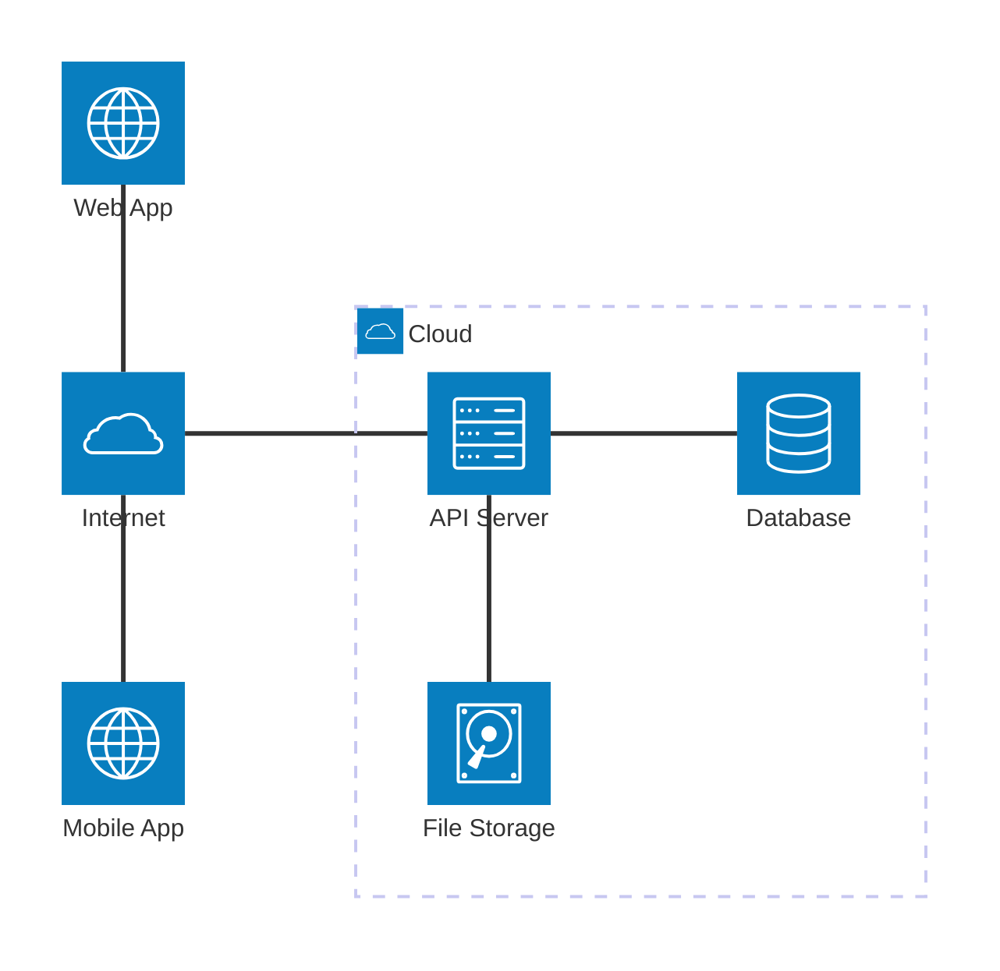

<h1 style="view-transition-name: deck-title">End to End Deployment</h1>

Part 1

---
src: ./part-1/presenter-introduction.md
---

---
layout: section
---

## So, what does it mean to deploy an app?

---
---

# How do most apps work?

<AppSpectrum />

---
layout: two-cols-header
---

# The Client-Server model

Your app (the **client**) talks to a **server** over the internet.

::left::

::right::

- **Client**: the browser tab or mobile app the user sees
- **Internet**: how the client reaches your server
- **API Server**: runs your backend code and exposes an API (e.g Hono, Express, FastAPI)
- **Database**: structured state (e.g PostgreSQL, MongoDB)
- **File Storage**: blobs like images, PDFs, videos (e.g S3)

---
layout: image
image: ./the-cloud.png
backgroundSize: contain
---

---
---
# Deployment Environments

