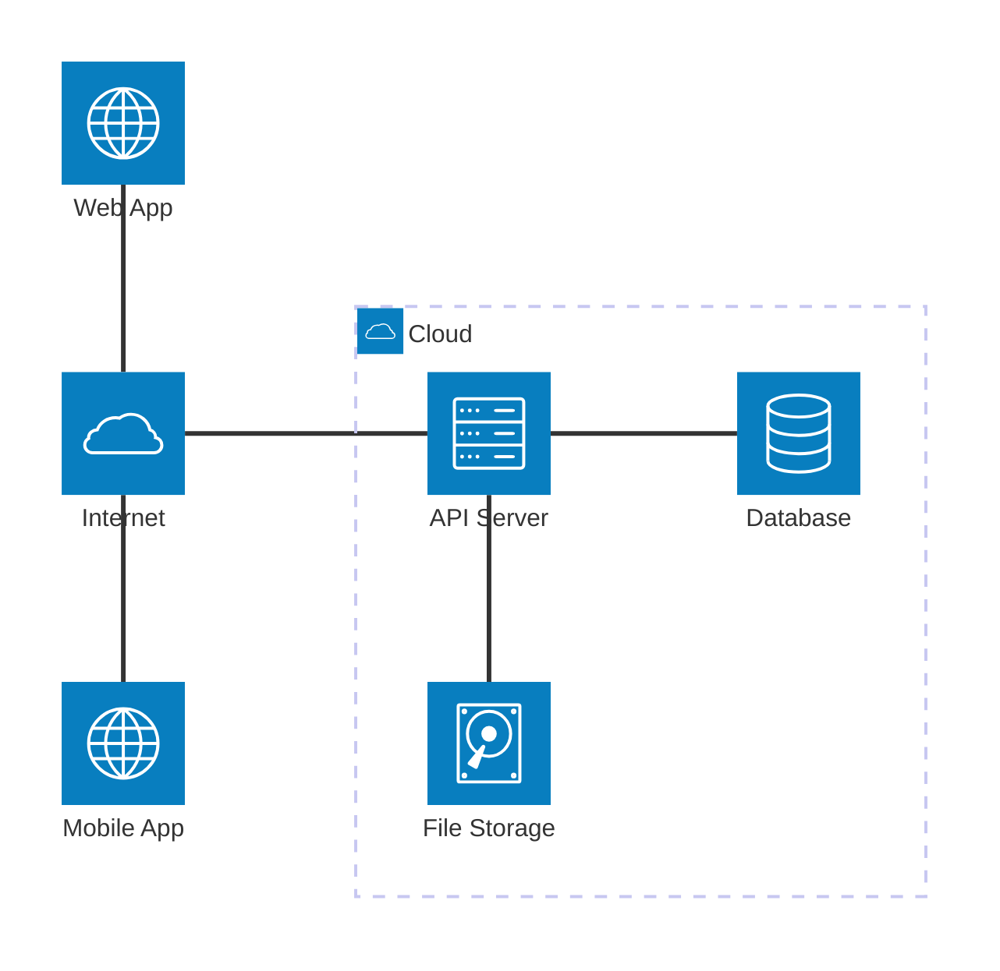
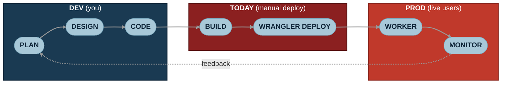
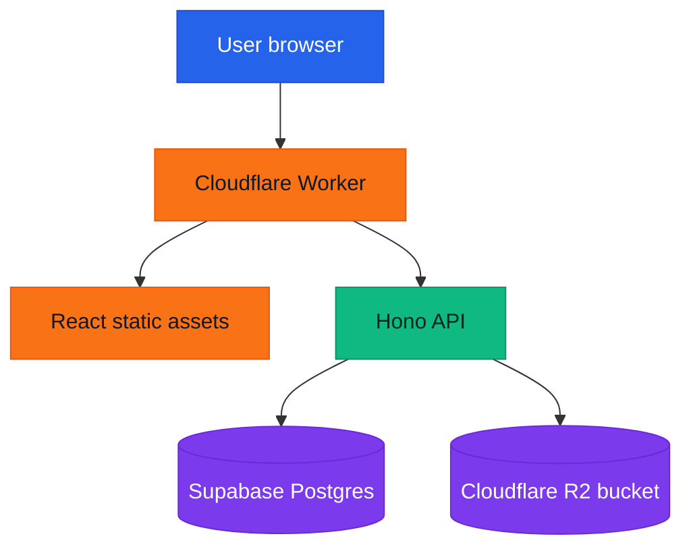
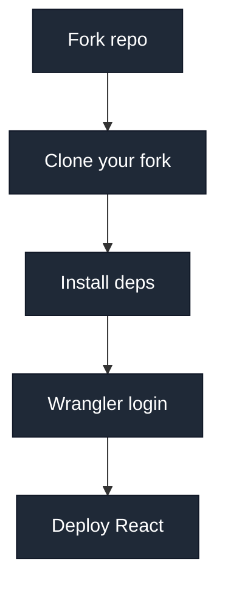
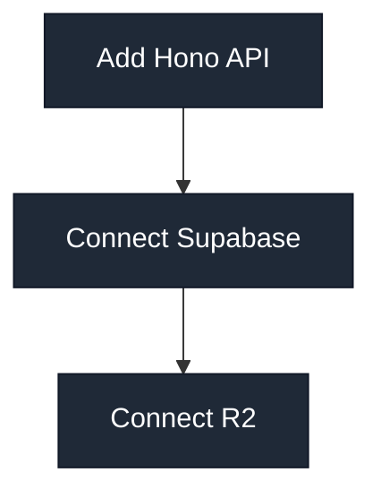

<h1 style="view-transition-name: deck-title">End to End Deployment</h1>

Part 1: From localhost to the internet

---
src: ./part-1/presenter-introduction.md
---

---
layout: section
---

## Today: make your app real

---
layout: two-cols-header
---

# Welcome, new intern!

Your first task: get the app off your laptop.

::left::


::right::

- You have a React app running locally
- Your friend cannot open `localhost:5173`
- Your boss wants a link that works for everyone
- Today, we make that link

---
layout: section
---

## Phase 1: Why deployment matters

---
---

# The localhost problem

`localhost` means "this computer".

<div class="grid grid-cols-2 gap-8 mt-10">
<div>

## On your laptop

- `localhost:5173` works
- Your code is nearby
- Your database might be fake or local
- Your secrets are in `.env`

</div>
<div>

## On your friend's laptop

- `localhost:5173` points to their laptop
- They do not have your running server
- They do not have your environment variables
- They cannot see what you see

</div>
</div>

---
layout: quote
---

# But boss, it works on my machine!

---
layout: two-cols-header
---

# Production fixes the audience problem

::left::

## Local

- Works for you
- Changes every time you edit code
- Good for development
- Bad as a public demo link

::right::

## Production

- Works from a public URL
- Runs on infrastructure you do not carry around
- Uses real configuration
- Gives everyone the same app

---
layout: section
---

## Phase 2: What runs where

---
---

# How do most apps work?

<AppSpectrum />

---
layout: two-cols-header
---

# The client-server model

Your app, the **client**, talks to a **server** over the internet.

::left::



::right::

- **Client**: the browser tab or mobile app the user sees
- **Internet**: how the client reaches your server
- **API server**: runs backend code, for example Hono, Express, FastAPI
- **Database**: structured state, for example users, posts, events
- **File storage**: blobs like images, PDFs, videos

---
layout: image
image: /the-cloud.png
backgroundSize: contain
---

---
---

# Deployment environments

| Environment | Where it runs | Who uses it | What it is for |
| --- | --- | --- | --- |
| Local | Your computer | You | Building and debugging |
| Staging | Cloud server | Your team | Testing before release |
| Production | Cloud server | Real users | The live app |

Staging matters, but we will go deeper in session 2.

---
---

# How code gets to production

Deployment is part of a loop, not a one-shot button press.

<div class="flex justify-center mt-4">


</div>

- Local is where you move fastest
- Staging is where the team checks before users see it
- Production is where mistakes become visible

---
---

# CI/CD

CI/CD is automation for the boring, repeatable parts of shipping.

<div class="grid grid-cols-2 gap-8 mt-8">
<div>

## Continuous Integration

- Runs on every push or pull request
- Installs dependencies
- Builds the app
- Runs tests and checks
- Blocks broken code from merging

</div>
<div>

## Continuous Delivery or Deployment

- Takes code that passed CI
- Publishes it to an environment
- Can deploy to staging first
- Can deploy to production after approval or merge

</div>
</div>

---
---

# CI/CD flow

<div class="flex justify-center mt-6">


</div>

Common tools: GitHub Actions, GitLab CI, Jenkins.

---
---

# How CI/CD fits today

Today, we will deploy manually so you understand what is happening.

<div class="flex justify-center mt-4">



</div>

Session 2 replaces the manual deploy step with GitHub Actions.

---
---

# Types of deployment

<div class="grid grid-cols-2 gap-6 mt-4 text-[0.95rem]">
<div>

## Static hosting

- Serves built HTML, CSS, JS, and assets
- Great for frontend-only apps
- Examples: Netlify, Vercel, Cloudflare Pages

</div>
<div>

## Traditional server

- You run a long-lived process
- You manage the machine or platform
- Examples: VPS, EC2, Render web service

</div>
<div>

## Containers

- Package app, dependencies, and runtime together
- Runs anywhere with a container runtime
- Examples: Docker, Fly.io, ECS, Kubernetes

</div>
<div>

## Serverless

- You ship functions or workers
- Platform handles runtime and scaling
- Examples: Cloudflare Workers, AWS Lambda

</div>
</div>

---
layout: two-cols-header
---

# Containerisation

::left::

- Packages the application, dependencies, and runtime into one container image
- Helps avoid "it works on my machine" environment drift
- Useful when you need a custom runtime or long-running service
- We will go deeper next session

::right::


---
layout: two-cols-header
---

# Serverless still uses servers

::left::

- You supply code
- The platform supplies the runtime
- The platform handles scaling, patching, and capacity
- You usually pay for requests or usage, not idle machines

::right::


---
---

# Serverless tradeoffs

<div class="grid grid-cols-2 gap-8 mt-8">
<div>

## Nice

- Low setup cost
- Scales without much planning
- No server maintenance
- Good fit for small student projects

</div>
<div>

## Watch out

- Platform-specific APIs
- Runtime limits
- Cold starts on some providers
- Debugging can feel different from local dev

</div>
</div>

---
---

# What we are building today

<div class="flex justify-center mt-4">



</div>

- React gives users the interface
- Hono gives us a small API server
- Supabase stores structured data
- R2 stores uploaded files

---
layout: section
---

## Phase 3: Deploy the frontend

---
layout: section
---

## Cloudflare

We're not sponsored btw

---
---

# Why Cloudflare for this workshop?

- Workers let us deploy backend code without managing a server
- Workers can also serve our built React app
- R2 gives us S3-like file storage
- The free tiers are friendly for demos and student projects
- You do not need to buy a domain today

---
layout: two-cols-header
---

# You do not need a domain

::left::

Cloudflare gives Workers a public URL:

```txt
https://your-project.your-subdomain.workers.dev
```

That is enough for this workshop.

::right::

Domains are optional:

- Nice for real projects
- Easier to remember
- Usually around SGD 15 per year for a `.com`
- Can be connected later

---
---

# Dashboard tour

When we open Cloudflare, look for:

- **Workers & Pages**: deployed apps and APIs
- **R2 Object Storage**: buckets and uploaded files
- **Account ID**: used by tooling and integrations
- **Workers logs**: useful when production behaves differently
- **Settings and billing**: check what plan you are on

---
---

# Before we start

You should have:

- Node.js installed
- `pnpm` installed
- A Cloudflare account
- A Supabase account
- Your own fork of this repository
- A terminal you are comfortable using

Keep your `.env` files and API keys out of Git.

---
---

# Workshop route map

<div class="grid grid-cols-2 gap-4 mt-4">
<div>



</div>
<div>



</div>
</div>

Each checkpoint should give you something you can open, call, or inspect.

---
---

# Fork and run the starter

Start here:

```txt
https://github.com/nushackers/orbital-26-deployment-workshop
```

Click **Fork**, then clone your fork:

```bash
git clone https://github.com/<your-username>/orbital-26-deployment-workshop.git
cd orbital-26-deployment-workshop/part-1
pnpm install
pnpm dev
```

Forking first matters because session 2 will connect CI/CD to your GitHub repo. Everyone needs their own copy to push to.

Checkpoint:

- You have a fork under your own GitHub account
- Local React app opens
- You can refresh without errors
- You can explain why the URL still only works for you

---
---

# Install and log in to Wrangler

Wrangler is Cloudflare's CLI.

```bash
pnpm add -D wrangler
pnpm wrangler login
pnpm wrangler whoami
```

Checkpoint:

- Browser opens the Cloudflare auth flow
- `whoami` shows your Cloudflare account
- You can deploy from this terminal

---
---

# Add `wrangler.jsonc`

Use `wrangler.jsonc` as the source of truth for deployment config.

```jsonc
{
  "$schema": "./node_modules/wrangler/config-schema.json",
  "name": "orbital-part-1",
  "main": "src/worker.ts",
  "compatibility_date": "2026-05-17",
  "assets": {
    "directory": "./dist",
    "binding": "ASSETS",
    "run_worker_first": ["/api/*"]
  },
  "observability": {
    "enabled": true
  }
}
```

Cloudflare supports JSON and TOML config. Their docs recommend `wrangler.jsonc` for new projects.

---
---

# Deploy the React app

```bash
pnpm build
pnpm wrangler deploy
```

Checkpoint:

- Wrangler prints a `workers.dev` URL
- The deployed URL loads your React app
- Your friend can open the same URL
- The Cloudflare dashboard shows a Worker deployment

---
layout: quote
---

# We now have production

Not perfect production. Real production.

---
layout: section
---

## Phase 4: Add backend, database, and file storage

---
---

# Add a Hono API

Hono is a tiny web framework that runs nicely on Workers.

```ts
import { Hono } from "hono";

const app = new Hono();

app.get("/api/health", (c) => {
  return c.json({
    ok: true,
    service: "orbital-part-1",
  });
});

export default app;
```

---
---

# API checkpoint

Open this in the browser:

```txt
https://your-project.your-subdomain.workers.dev/api/health
```

Expected response:

```json
{
  "ok": true,
  "service": "orbital-part-1"
}
```

If this works, your deployed frontend and deployed backend are sharing one public origin.

---
---

# Add Supabase

Supabase gives us hosted Postgres plus a friendly dashboard.

Today we only need:

- Project URL
- An API key suitable for the demo
- One simple table
- One API route that reads or writes a row

Keep deeper database design for later.

---
---

# Supabase environment variables

Local development uses `.dev.vars`:

```bash
SUPABASE_URL="https://example.supabase.co"
SUPABASE_KEY="replace-me"
```

Production uses Cloudflare secrets:

```bash
pnpm wrangler secret put SUPABASE_URL
pnpm wrangler secret put SUPABASE_KEY
```

Never commit real secrets.

---
---

# Supabase API shape

Use one simple route for the workshop:

```txt
GET /api/items
POST /api/items
```

Checkpoint:

- `GET /api/items` returns JSON from Supabase
- `POST /api/items` creates one row
- Refreshing the deployed app still shows the data

---
---

# Add Cloudflare R2

R2 is file storage for blobs:

- Images
- PDFs
- Videos
- User uploads
- Generated files

The database should store metadata. R2 should store the actual file bytes.

---
---

# Create and bind an R2 bucket

```bash
pnpm wrangler r2 bucket create orbital-part-1-files
```

Add the binding to `wrangler.jsonc`:

```jsonc
{
  "r2_buckets": [
    {
      "binding": "FILES",
      "bucket_name": "orbital-part-1-files"
    }
  ]
}
```

The binding name is what your Worker code uses.

---
---

# R2 API shape

Use one small file route:

```txt
POST /api/files
GET /api/files/:key
```

Checkpoint:

- Upload stores an object in R2
- The dashboard shows the object in the bucket
- The GET route returns or redirects to the file
- Supabase can store the file key as metadata

---
---

# The final architecture

<div class="flex justify-center mt-4">


</div>

---
---

# CI/CD reminder

We are doing the first deployment by hand today.

- You should still understand what CI/CD is
- You should know which steps are being automated later
- You should be able to read a deploy log without panicking
- Session 2: GitHub Actions takes over the repeatable parts

---
---

# What success looks like

By the end, you should have:

- A public `workers.dev` URL
- A React app served by Cloudflare Workers
- `GET /api/health` returning JSON
- A Hono route connected to Supabase
- An R2 bucket bound to the Worker
- At least one file stored through the app or API

---
---

# What we are saving for session 2

- Staging environments
- GitHub Actions CI/CD
- Automated tests before deploy
- Containerisation in more depth
- Monitoring and production debugging
- Safer secrets, migrations, and release workflows

---
layout: quote
---

# Ship the smallest real thing first.

Then make shipping boring.
