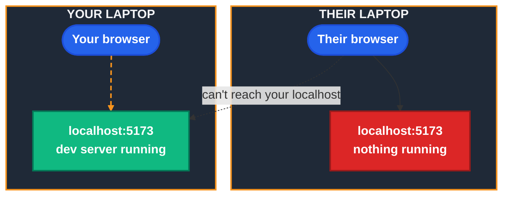
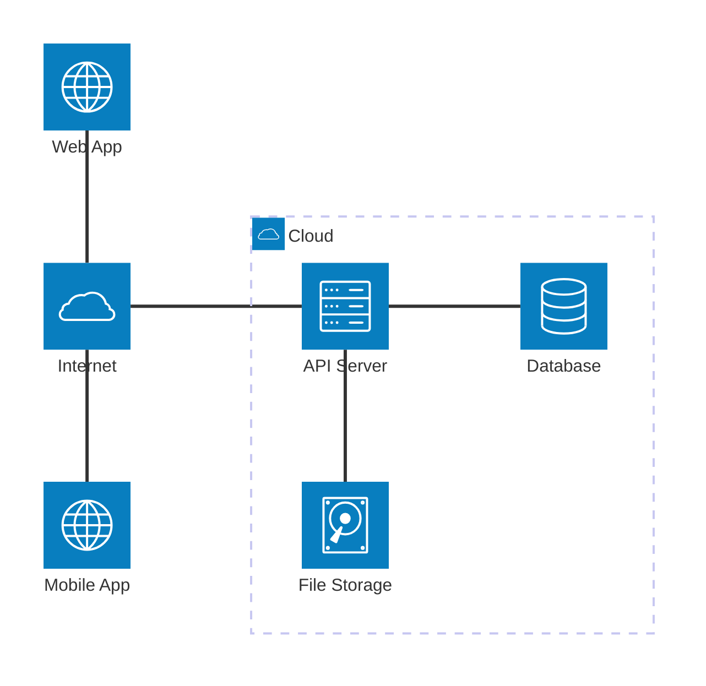
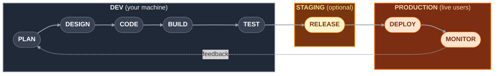
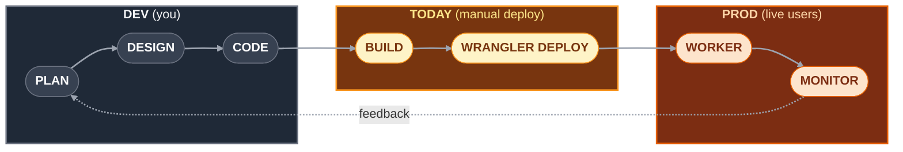
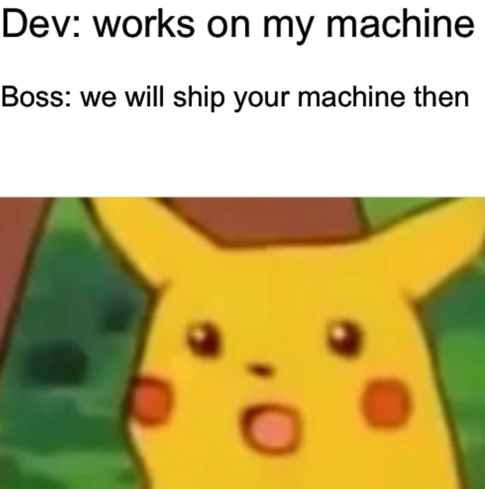
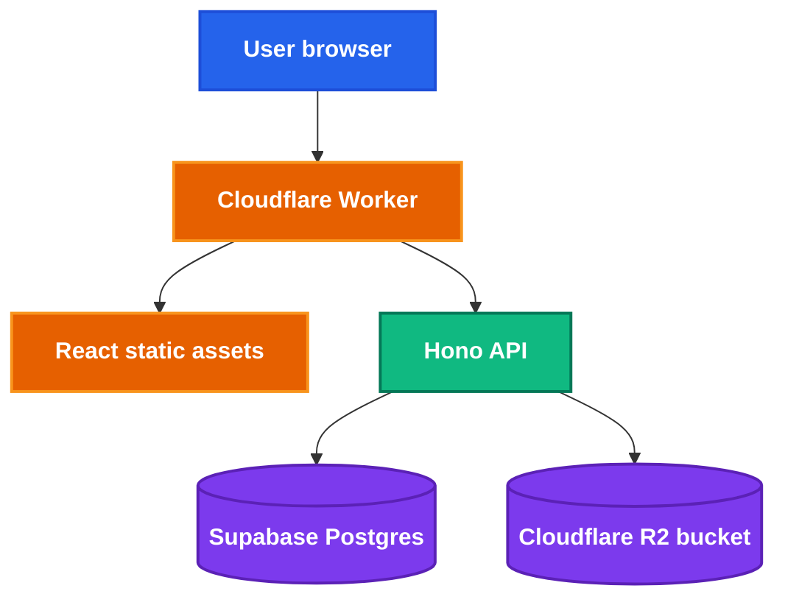
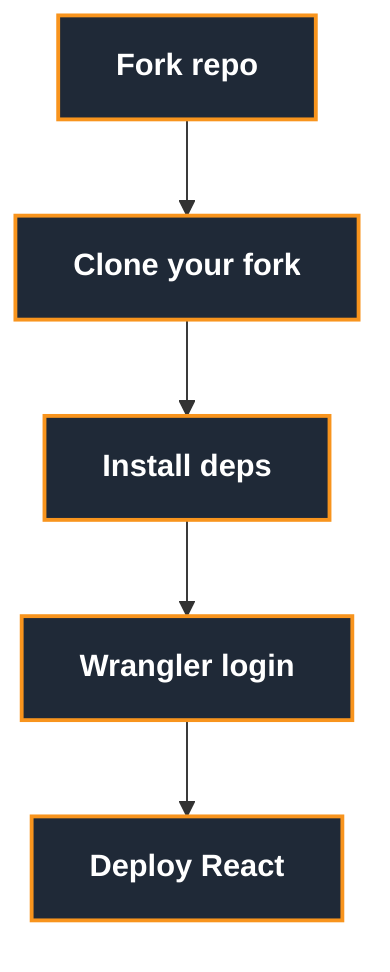
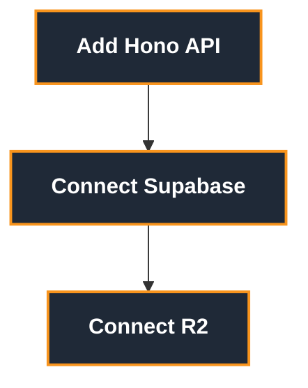
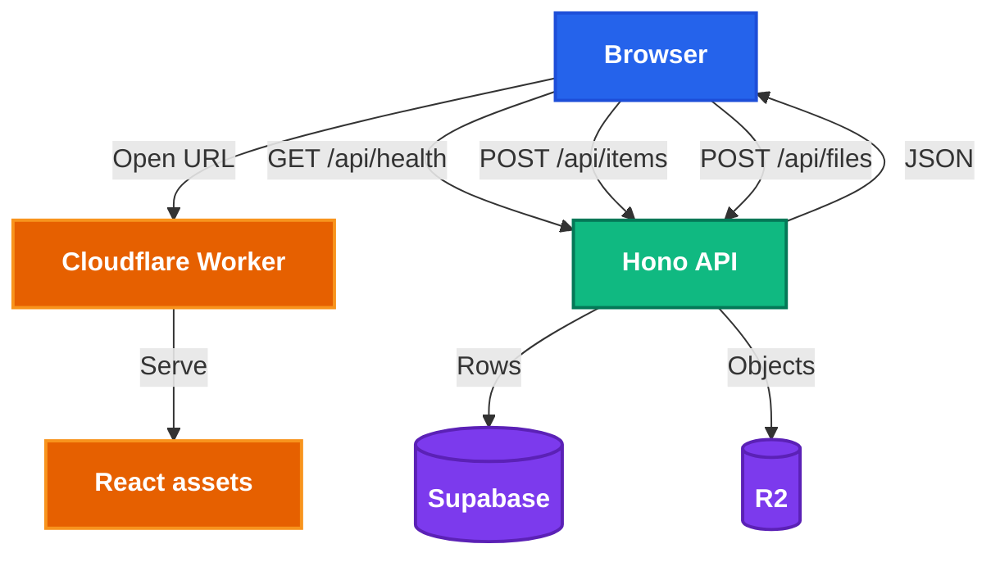

<h1 style="view-transition-name: deck-title">End to End Deployment</h1>

Part 1: From localhost to the internet

---
src: ./part-1/presenter-introduction.md
---

---
layout: section
---

## Today, let's make your app real!

---
layout: center
class: text-center
---

## So, you've built your app.

But it's stuck on your laptop.


---
layout: center
class: text-center
---

# The localhost problem

When they open: `http://localhost:5173`  
Their browser looks on **their** machine, not yours.

<div class="flex justify-center mt-6">



</div>

`localhost` always means "this computer."

---
layout: two-cols-header
---

# To production and beyond!


::left::

## Local

A local server is great for development.

- It lets you test changes immediately.

- You can break things without affecting others.

But... you can't expect everyone to have your laptop.


::right::

## Production

Our ultimate goal is to deploy to a production environment. 

A production environment:

- is where the latest stable version of your app runs
- is accessible to everyone, not just you
- requires higher standards of quality and reliability


---
layout: section
---

## What does it mean to deploy to production?

---
---

# How do most apps work?

<AppSpectrum />

---
layout: two-cols-header
class: diagram-heavy compact
---

# The client-server model

Most apps work like this:

Your app, the **client** (running on the user's device), talks to a **server** over the internet.

::left::



::right::

- **Client**: the browser tab or mobile/desktop app the user sees
- **Internet**: how the client reaches your server
- **API server**: runs backend code, for example Hono, Express, FastAPI
- **Database**: structured state, for example users, posts, events
- **File storage**: blobs like images, PDFs, videos

---
layout: image
image: /the-cloud.png
backgroundSize: contain
---

---
---

# Deployment environments


| Environment | Where it runs | Who uses it | What it is for |
| --- | --- | --- | --- |
| Local | Your computer | You | Building and debugging |
| Staging | Cloud server | Your team | Testing before release |
| Production | Cloud server | Real users | The live app |

We'll skip the staging environment in this workshop (and frankly, you probably don't need it for Orbital), but the tl;dr is: it's a copy of the production environment, minus the live users.

---
class: diagram-heavy compact
---

# How code gets to production

The **Software Development Lifecycle (SDLC)**

<div class="flex justify-center mt-2">



</div>

<v-clicks depth="2" class="mt-3 text-sm">

- **Dev**: your machine
  - **Plan & design**: decide what to build *(out of scope today)*
  - **Code, build, test**: write the app, compile it, try it
- **Staging**: replica server 
  - **Release**: one last check before real users see it
- **Production**: live users
  - **Deploy**: push your build to a public URL
  - **Monitor**: watch logs and errors after users hit it
- **Feedback loop**: what breaks in production feeds the next plan

</v-clicks>


---
layout: two-cols-header
---

# When deployment goes wrong

Ever lost your company millions in a few minutes?

::left::

<div class="ml-6 pr-2 pb-12 pt-2">
  
</div>


::right::

<div class="ml-6 pr-2 pb-12 pt-2">
  
</div>


---
layout: two-cols-header
---

# Oops... what broke?


Knight reused an old flag bit for a new trading feature.

::left::

Previously, this bit was used to enable a "Power Peg" trading strategy.

When this bit was set, the server would "buy high and sell low" (not good investment advice btw).

Unfortunately, when they deployed the new feature manually, one of the servers missed the update.

When markets opened, the old server began shredding money.

So they tried to roll back all the servers, but that just made all the servers run the old code.

::right::

<div class="ml-6 pr-2 pb-12 pt-2">
  
</div>

Source: [YouTube:
Dev Loses $440 Million in 28 minutes, Chaos Ensues
](https://youtu.be/263CooDJZCY)


---
class: compact
---

# So why am I telling you this?

- Deploying by hand works until it doesn't
- You want the same build on every server, every time
- That's what CI/CD automates
- You probably won't lose $440M, but you can still ship broken code to real users


---
layout: statement
---

### By the way, if you're wondering what happened to the guy who messed up the deployment...

<!-- he didn't get fired; management did. bad process, not one bad engineer. -->


---
---

# CI/CD

CI/CD is automation for the boring, repeatable parts of shipping.

<div class="grid grid-cols-2 gap-8 mt-8">
<div>

## Continuous Integration

- Runs on every push or pull request
- Installs dependencies
- Builds the app
- Runs tests and checks
- Blocks broken code from merging

</div>
<div>

## Continuous Delivery or Deployment

- Takes code that passed CI
- Publishes it to an environment
- Can deploy to staging first
- Can deploy to production after approval or merge

</div>
</div>

---
class: diagram-heavy compact
---

# CI/CD flow

<div class="flex justify-center mt-6">


</div>

Common tools: GitHub Actions, GitLab CI, Jenkins.

---
class: diagram-heavy compact
---

# How CI/CD fits today

Today, we will deploy manually so you understand what is happening.

<div class="flex justify-center mt-4">



</div>

Session 2 replaces the manual deploy step with GitHub Actions.

---
---

# Types of deployment

<div class="grid grid-cols-2 gap-6 mt-4 text-[0.95rem]">
<div>

## Static hosting

- Serves built HTML, CSS, JS, and assets
- Great for frontend-only apps
- Examples: Netlify, Vercel, Cloudflare Pages

</div>
<div>

## Traditional server

- You run a long-lived process
- You manage the machine or platform
- Examples: VPS, EC2, Render web service

</div>
<div>

## Containers

- Package app, dependencies, and runtime together
- Runs anywhere with a container runtime
- Examples: Docker, Fly.io, ECS, Kubernetes

</div>
<div>

## Serverless

- You ship functions or workers
- Platform handles runtime and scaling
- Examples: Cloudflare Workers, AWS Lambda

</div>
</div>

---
layout: two-cols-header
---

# Containerisation

::left::

- Packages the application, dependencies, and runtime into one container image
- Helps avoid "it works on my machine" environment drift
- Useful when you need a custom runtime or long-running service
- We will go deeper next session

::right::



---
layout: two-cols-header
---

# Serverless still uses servers

::left::

- You supply code
- The platform supplies the runtime
- The platform handles scaling, patching, and capacity
- You usually pay for requests or usage, not idle machines

::right::


---
---

# Serverless tradeoffs

<div class="grid grid-cols-2 gap-8 mt-8">
<div>

## Nice

- Low setup cost
- Scales without much planning
- No server maintenance
- Good fit for small student projects

</div>
<div>

## Watch out

- Platform-specific APIs
- Runtime limits
- Cold starts on some providers
- Debugging can feel different from local dev

</div>
</div>

---
class: diagram-heavy compact
---

# What we are building today

<div class="flex justify-center mt-4">



</div>

- React gives users the interface
- Hono gives us a small API server
- Supabase stores structured data
- R2 stores uploaded files

---
layout: section
---

## Let's deploy our app!

---
layout: section
---

## Cloudflare

We're not sponsored btw

---
---

# Why Cloudflare for this workshop?

- Workers let us deploy backend code without managing a server
- Workers can also serve our built React app
- R2 gives us S3-like file storage
- The free tiers are friendly for demos and student projects
- You do not need to buy a domain today

---
layout: two-cols-header
---

# You do not need a domain

::left::

Cloudflare gives Workers a public URL:

```txt
https://your-project.your-subdomain.workers.dev
```

That is enough for this workshop.

::right::

Domains are optional:

- Nice for real projects
- Easier to remember
- Usually around SGD 15 per year for a `.com`
- Can be connected later

---
---

# Dashboard tour

When we open Cloudflare, look for:

- **Workers & Pages**: deployed apps and APIs
- **R2 Object Storage**: buckets and uploaded files
- **Account ID**: used by tooling and integrations
- **Workers logs**: useful when production behaves differently
- **Settings and billing**: check what plan you are on

---
---

# Before we start

You should have:

- Node.js installed
- `pnpm` installed
- A Cloudflare account
- A Supabase account
- Your own fork of this repository
- A terminal you are comfortable using

Keep your `.env` files, `.dev.vars`, and API keys out of Git.

---
class: diagram-heavy compact
---

# Workshop route map

<div class="grid grid-cols-2 gap-4 mt-4">
<div>



</div>
<div>



</div>
</div>

Each checkpoint should give you something you can open, call, or inspect.

---
---

<CheckpointBadge />

# Fork the starter

Start here:

```txt
https://hckr.cc/orbital-deployment-26
```

<div class="flex items-center gap-3 my-3">
  <span class="bg-orange-500 text-white font-black text-xl px-4 py-1.5 rounded-lg shadow tracking-wide">FORK</span>
  <span class="text-gray-400 font-semibold italic">not clone</span>
</div>

Click **Fork** to create your own copy under your GitHub account.

Forking first matters because session 2 will connect CI/CD to your GitHub repo. Everyone needs their own copy to push to.

Checkpoint:

- You have a fork under your own GitHub account
- You can push branches without touching the workshop repo

---
---

<CheckpointBadge />

# Run the starter locally

Clone your fork:

```bash
git clone https://github.com/<your-username>/orbital-26-deployment-workshop.git
cd orbital-26-deployment-workshop/part-1
pnpm install
pnpm dev
```

Checkpoint:

- Local React app opens
- You can refresh without errors
- You can explain why the URL still only works for you

---
---

<CheckpointBadge />

# Install and log in to Wrangler

Wrangler is Cloudflare's CLI.

```bash
pnpm add -D wrangler
pnpm wrangler login
pnpm wrangler whoami
```

Checkpoint:

- Browser opens the Cloudflare auth flow
- `whoami` shows your Cloudflare account
- You can deploy from this terminal

---
---

# Add `wrangler.jsonc`

Use `wrangler.jsonc` as the source of truth for deployment config.

```jsonc
{
  "$schema": "./node_modules/wrangler/config-schema.json",
  "name": "orbital-part-1",
  "main": "src/worker.ts",
  "compatibility_date": "2026-05-17",
  "assets": {
    "directory": "./dist",
    "binding": "ASSETS",
    "run_worker_first": ["/api/*"]
  },
  "observability": {
    "enabled": true
  }
}
```

Cloudflare supports JSON and TOML config. Their docs recommend `wrangler.jsonc` for new projects.

---
---

<CheckpointBadge />

# Deploy the React app

```bash
pnpm build
pnpm wrangler deploy
```

Checkpoint:

- Wrangler prints a `workers.dev` URL
- The deployed URL loads your React app
- Your friend can open the same URL
- The Cloudflare dashboard shows a Worker deployment

---
layout: quote
---

# Behold, production!

---
---

# Add a Hono API

Hono is a tiny web framework that runs nicely on Workers.

```ts
import { Hono } from "hono";

const app = new Hono();

app.get("/api/health", (c) => {
  return c.json({
    ok: true,
    service: "orbital-part-1",
  });
});

export default app;
```

---
---

<CheckpointBadge />

# API checkpoint

Open this in the browser:

```txt
https://your-project.your-subdomain.workers.dev/api/health
```

Expected response:

```json
{
  "ok": true,
  "service": "orbital-part-1"
}
```

If this works, your deployed frontend and deployed backend are sharing one public origin.

---
---

# Add Supabase

Supabase gives us hosted Postgres plus a friendly dashboard.

Create a project if you have not already. Today we only need:

- Project URL
- Publishable API key
- One `items` table
- One Hono route that reads from it

Keep deeper database design for later.

---
---

<CheckpointBadge />

# Create an `items` table

In the Supabase dashboard, open **SQL Editor** or **Table Editor**.

SQL version:

```sql
create table public.items (
  id uuid primary key default gen_random_uuid(),
  name text not null,
  created_at timestamptz default now()
);
```

Checkpoint:

- You see `items` in the dashboard
- You can explain what a row represents in your app

---
---

# Turn on RLS for the demo

Supabase uses **Row Level Security**. New tables often have RLS enabled with no policies yet. When that happens, reads return zero rows, and writes are denied with an error.

For today only, add a permissive policy:

```sql
alter table public.items enable row level security;

create policy "Workshop demo access"
  on public.items
  for all
  to anon, authenticated
  using (true)
  with check (true);
```

Real projects would not use `using (true)` in production.

If queries still fail, check **Authentication → Policies** first.

---
---

# Which API key?

From **Settings → API Keys** in Supabase:

- **Project URL** → `SUPABASE_URL`
- **Publishable key** (`sb_publishable_...`) → `SUPABASE_KEY`

The publishable key replaced the old `anon` key. Either works for this workshop.

This key respects RLS. Keep it in the Worker, not in your React bundle.

Never put the **secret** / `service_role` key in frontend code.

---
---

# Supabase environment variables

Local development uses `.dev.vars`:

```bash
SUPABASE_URL="https://example.supabase.co"
SUPABASE_KEY="replace-me"
```

Production uses Cloudflare secrets:

```bash
pnpm wrangler secret put SUPABASE_URL
pnpm wrangler secret put SUPABASE_KEY
```

Please don't commit real secrets.


---
---

# Connect Hono to Supabase

```bash
pnpm add @supabase/supabase-js
```

```ts
import { createClient } from "@supabase/supabase-js";

app.get("/api/items", async (c) => {
  const supabase = createClient(
    c.env.SUPABASE_URL,
    c.env.SUPABASE_KEY,
  );
  const { data, error } = await supabase.from("items").select("*");
  if (error) return c.json({ error: error.message }, 500);
  return c.json(data);
});
```

Use the same client pattern for `POST /api/items`.

---
---

<CheckpointBadge />

# Supabase checkpoint

Open in the browser:

```txt
https://your-project.your-subdomain.workers.dev/api/items
```

Expected at first:

```json
[]
```

After you insert a row:

```json
[
  {
    "id": "...",
    "name": "hello",
    "created_at": "..."
  }
]
```

If you get `[]` forever or a 500, check RLS policies first.

---
---

# Add Cloudflare R2

R2 is file storage for blobs:

- Images
- PDFs
- Videos
- User uploads
- Generated files

The database should store metadata. R2 should store the actual file bytes.

---
---

# Create and bind an R2 bucket

```bash
pnpm wrangler r2 bucket create orbital-part-1-files
```

Add the binding to `wrangler.jsonc`:

```jsonc
{
  "r2_buckets": [
    {
      "binding": "FILES",
      "bucket_name": "orbital-part-1-files"
    }
  ]
}
```

The binding name is what your Worker code uses.

---
---

<CheckpointBadge />

# R2 API shape

Use one small file route:

```txt
POST /api/files
GET /api/files/:key
```

Checkpoint:

- Upload stores an object in R2
- The dashboard shows the object in the bucket
- The GET route returns or redirects to the file
- Supabase can store the file key as metadata

---
class: diagram-heavy compact
---

# The final architecture

<div class="flex justify-center mt-4">



</div>

---
---

# CI/CD reminder

We are doing the first deployment by hand today.

- You should still understand what CI/CD is
- You should know which steps are being automated later
- You should be able to read a deploy log without panicking
- Session 2: GitHub Actions takes over the repeatable parts

---
---

# What success looks like

By the end, you should have:

- A public `workers.dev` URL
- A React app served by Cloudflare Workers
- `GET /api/health` returning JSON
- `GET /api/items` returning rows from Supabase
- An R2 bucket bound to the Worker
- At least one file stored through the app or API

---
---

# What's next?

- Staging environments
- GitHub Actions CI/CD
- Automated tests before deploy
- Containerisation in more depth
- Monitoring and production debugging
- Safer secrets, migrations, and release workflows

---
layout: quote
---

# Ship the smallest real thing first.

Then make shipping boring.
