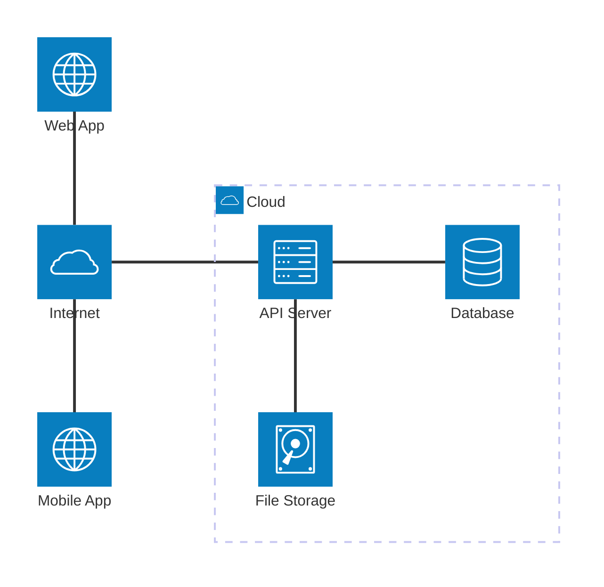
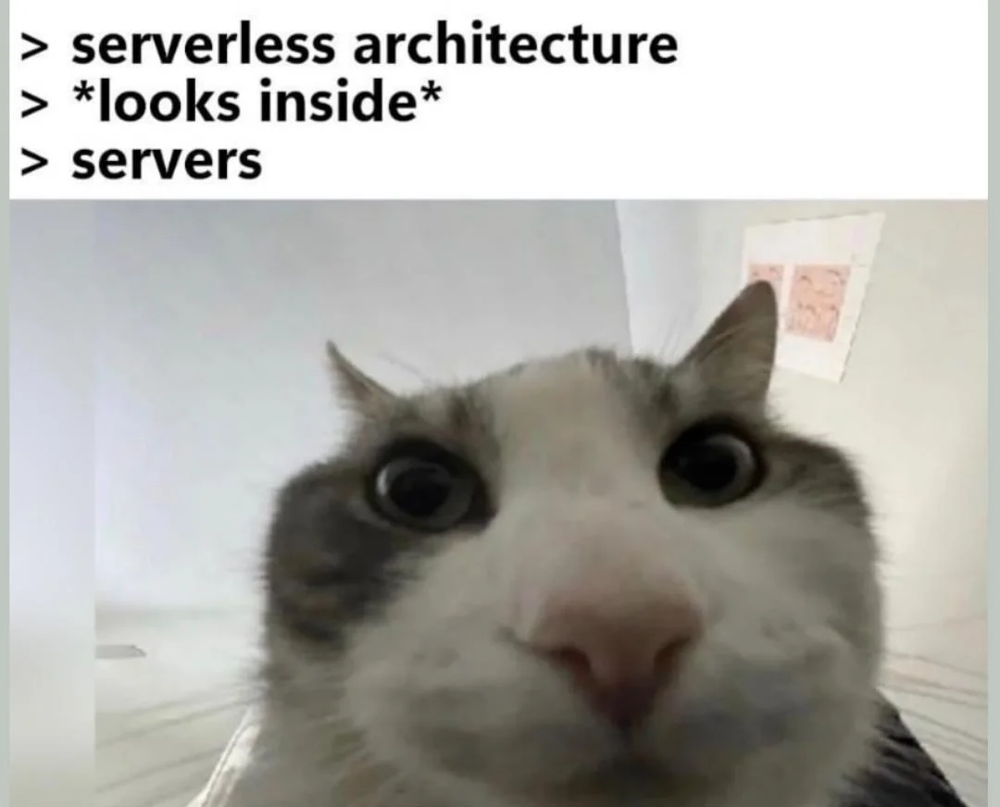
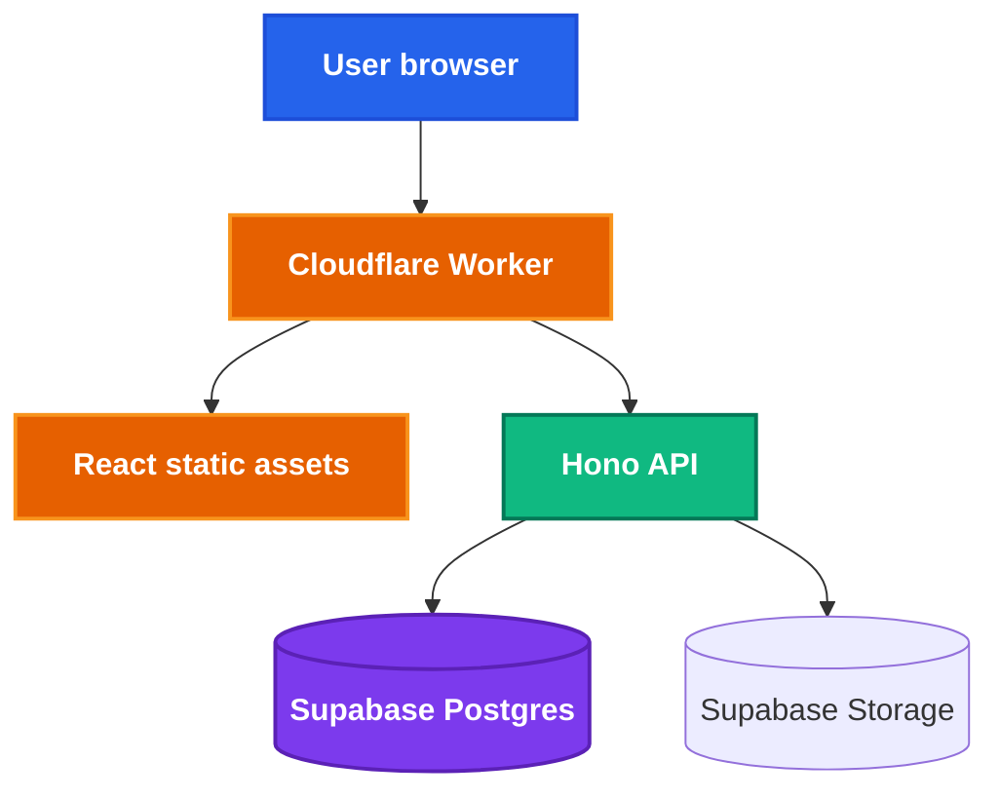
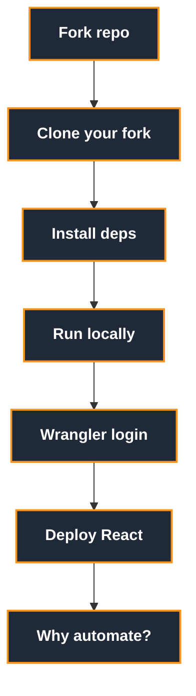
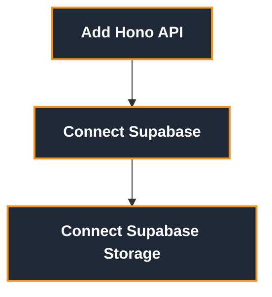
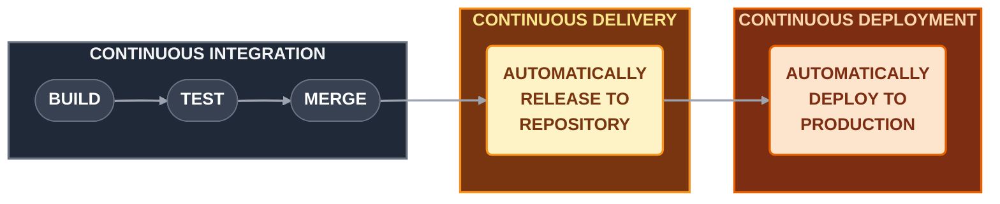
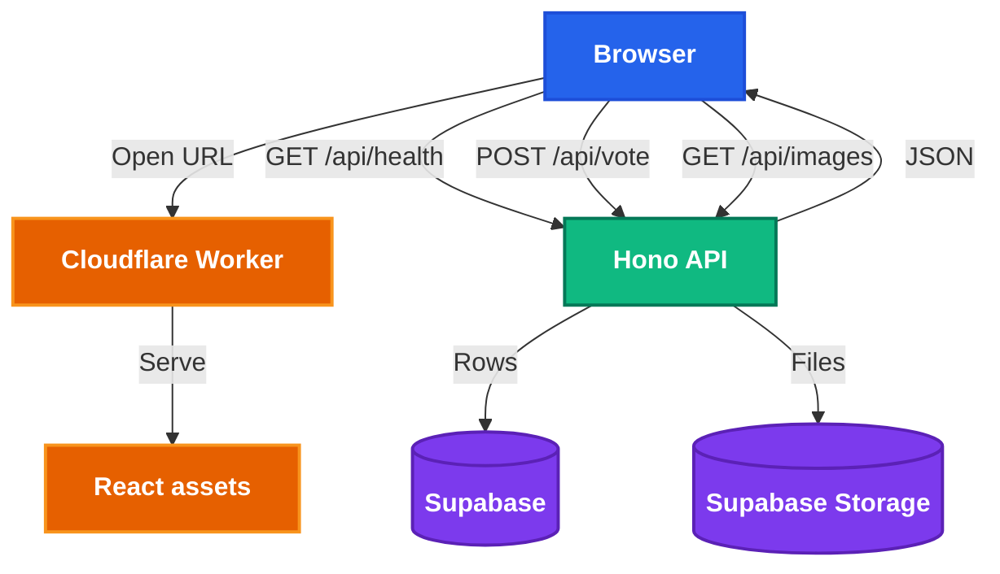

<h1 style="view-transition-name: deck-title">End to End Deployment</h1>

Part 1: From localhost to the internet

---
src: ./part-1/presenter-introduction.md
---

---
layout: section
---

## Today, let's make your app real!

---
layout: center
class: text-center
---

# So... you built something.


<!--
You drop the link in your team chat: `localhost:5173`
Your teammate opens it and gets... nothing.
Why? Because the app is running in a place only your computer understands.
-->

---
layout: two-cols-header
class: compact media-heavy laptop-as-server-slide
---

# Why did the link fail?

::left::

<LaptopAsServer />

::right::

## Your teammate opens it

- Their `localhost` means **their laptop**
- Nothing is listening on port `5173`
- Your dev server is not on the public internet
- So the link only works on your machine

<!--
Optional verbal gloss:
localhost = this machine
5173 = which program on this machine
So localhost:5173 means "ask this machine for the app on port 5173".
Your teammate's machine asks itself, not yours.
-->

---
---

# How do most apps work?

<AppSpectrum />

---
layout: two-cols-header
class: compact diagram-heavy
---

# Deployment can mean distribution

::left::

<div class="mt-6 flex items-center justify-center gap-2 text-center">
  <div v-click class="rounded-[8px] border border-[var(--nus-border)] bg-[var(--nus-surface)] p-3 shadow-[var(--nus-shadow)]">
    
    <div class="mt-2 text-sm font-semibold">Calculator app</div>
    <div class="nus-token-faint mt-1 text-[0.68rem]">Logic runs on-device</div>
  </div>
  <div v-click class="nus-token-accent text-2xl font-bold">&rarr;</div>
  <div v-click class="rounded-[8px] border border-[var(--nus-border)] bg-[var(--nus-surface)] p-3 shadow-[var(--nus-shadow)]">
    <div class="mx-auto grid h-14 w-14 place-items-center rounded-[12px] bg-[color-mix(in_srgb,var(--nus-accent),transparent_82%)] text-xl font-bold text-[var(--nus-accent)]">.apk</div>
    <div class="mt-2 text-sm font-semibold">Build artifact</div>
    <div class="nus-token-faint mt-1 text-[0.68rem]">Signed package</div>
  </div>
  <div v-click class="nus-token-accent text-2xl font-bold">&rarr;</div>
  <div v-click class="rounded-[8px] border border-[var(--nus-border)] bg-[var(--nus-surface)] p-3 shadow-[var(--nus-shadow)]">
    
    <div class="mt-2 text-sm font-semibold">Store install</div>
    <div class="nus-token-faint mt-1 text-[0.68rem]">App Store, Play Store, direct</div>
  </div>
</div>

::right::

<v-clicks>

## Fully offline

- No API server
- No database in the cloud
- No process to keep running
- Production is the version users have installed

</v-clicks>

<!--
Deployment question:
What file do users install, and how do updates reach them?
-->

---
layout: two-cols-header
class: compact diagram-heavy
---

# Deployment can mean hosting a world

::left::

<div class="mt-2 grid grid-cols-[1.05fr_auto_1.05fr_auto_1.1fr] items-center gap-2 text-center text-[0.66rem] leading-tight">
  <div v-click class="rounded-[8px] border border-[var(--nus-border)] bg-[var(--nus-surface)] p-2 shadow-[var(--nus-shadow)]">
    
    <div class="mt-1 font-semibold">Launcher</div>
    <div class="nus-token-faint mt-0.5">Installs, updates, signs in</div>
  </div>
  <div v-click class="nus-token-accent text-xl font-bold">&rarr;</div>
  <div v-click class="rounded-[8px] border border-[var(--nus-border)] bg-[var(--nus-surface)] p-2 shadow-[var(--nus-shadow)]">
    
    <div class="mt-1 font-semibold">Client</div>
    <div class="nus-token-faint mt-0.5">Runs on player's device</div>
  </div>
  <div v-click class="nus-token-accent text-xl font-bold">&harr;</div>
  <div v-click class="rounded-[8px] border border-[var(--nus-border)] bg-[var(--nus-surface)] p-2 shadow-[var(--nus-shadow)]">
    
    <div class="mt-1 font-semibold">Server</div>
    <div class="nus-token-faint mt-0.5">Runs somewhere reachable</div>
  </div>

  <div v-click class="col-span-5 grid grid-cols-[1fr_auto_1fr] items-center gap-2">
    <div class="rounded-[8px] border border-[var(--nus-border)] bg-[var(--nus-surface)] px-3 py-2 shadow-[var(--nus-shadow)]">
      <div class="font-semibold text-[var(--nus-accent)]">Microsoft account</div>
      <div class="nus-token-faint mt-0.5">Java Edition identity</div>
    </div>
    <div class="nus-token-muted text-lg">&rarr;</div>
    <div class="rounded-[8px] border border-[var(--nus-border)] bg-[var(--nus-surface)] px-3 py-2 shadow-[var(--nus-shadow)]">
      <div class="font-semibold text-[var(--nus-success)]">Online-mode check</div>
      <div class="nus-token-faint mt-0.5">Server verifies players</div>
    </div>
  </div>

  <div v-click class="col-span-5 rounded-[8px] border border-[var(--nus-border)] bg-[color-mix(in_srgb,var(--nus-warning),transparent_90%)] px-3 py-2 text-left shadow-[var(--nus-shadow)]">
    <div class="font-semibold text-[var(--nus-warning)]">Deployed game server</div>
    <div class="nus-token-faint mt-0.5">Owns the shared world state, for example blocks, mobs, inventories, and player positions.</div>
  </div>
</div>

::right::

<v-clicks>

## Multiplayer changes the deployment

- Single-player worlds can live on your device
- Multiplayer needs a reachable server
- Clients send actions and receive world updates
- The server decides the shared truth

</v-clicks>

<!--
Deployment question:
Where is the server running, and can players reach it reliably?
-->

---
layout: two-cols-header
class: compact diagram-heavy
---

# Deployment can mean client plus cloud

::left::

<div class="mt-5 grid grid-cols-[1fr_auto_1.1fr] items-center gap-4 text-center text-[0.78rem]">
  <div class="space-y-3">
    <div v-click class="rounded-[8px] border border-[var(--nus-border)] bg-[var(--nus-surface)] p-3 shadow-[var(--nus-shadow)]">
      
      <div class="mt-2 font-semibold">Mobile app</div>
      <div class="nus-token-faint mt-1">Installed by users</div>
    </div>
    <div v-click class="rounded-[8px] border border-[var(--nus-border)] bg-[var(--nus-surface)] p-3 shadow-[var(--nus-shadow)]">
      
      <div class="mt-2 font-semibold">Web app</div>
      <div class="nus-token-faint mt-1">Loaded in browser</div>
    </div>
  </div>
  <div v-click class="nus-token-accent text-3xl font-bold">&rarr;</div>
  <div v-click class="rounded-[8px] border border-[var(--nus-border)] bg-[var(--nus-surface)] p-3 shadow-[var(--nus-shadow)]">
    <div class="mx-auto grid h-14 w-14 place-items-center rounded-[10px] bg-[color-mix(in_srgb,var(--nus-success),transparent_82%)] text-xl font-bold text-[var(--nus-success)]">API</div>
    <div class="mt-2 text-base font-semibold">Backend services</div>
    <div class="mt-3 grid grid-cols-[minmax(0,1fr)_minmax(0,1.25fr)] gap-2 text-[0.68rem]">
      <div class="rounded-[8px] border border-[var(--nus-border)] px-1.5 py-1">Accounts</div>
      <div class="rounded-[8px] border border-[var(--nus-border)] px-1.5 py-1">Bookings</div>
      <div class="rounded-[8px] border border-[var(--nus-border)] px-1.5 py-1">Payments</div>
      <div class="rounded-[8px] border border-[var(--nus-border)] px-1.5 py-1">Maps</div>
      <div class="rounded-[8px] border border-[var(--nus-border)] px-1.5 py-1">Database</div>
      <div class="rounded-[8px] border border-[var(--nus-border)] px-1.5 py-1">Notifications</div>
    </div>
  </div>
</div>

::right::

<v-clicks>

## Two things get shipped

- The app store ships the mobile client
- Web hosting ships the browser client
- Backend deployment ships live data and behavior
- You can update the backend without asking users to reinstall

</v-clicks>

<!--
Deployment question:
Which parts live on users' devices, and which parts run in the cloud?
-->

---
layout: two-cols-header
class: diagram-heavy compact
---

# The client-server model

Most apps work like this:

Your app, the **client** (running on the user's device), talks to a **server** over the internet.

::left::



::right::

- **Client**: the browser tab or mobile/desktop app the user sees
- **Internet**: how the client reaches your server
- **API server**: runs backend code, for example Hono, Express, FastAPI
- **Database**: structured state, for example users, posts, events
- **File storage**: blobs like images, PDFs, videos

---
layout: two-cols-header
---

# To production and beyond!


::left::

## Local

A local server is great for development.

- It lets you test changes immediately.

- You can break things without affecting others.

But... you can't expect everyone to have your laptop.


::right::

## Production

Our ultimate goal is to deploy to a production environment.

A production environment:

- is where the latest stable version of your app runs
- is accessible to everyone, not just you
- requires higher standards of quality and reliability


---
layout: section
---

## What does it mean to deploy to production?

---
layout: image
image: /the-cloud.webp
backgroundSize: contain
---

---
---

# Deployment environments


| Environment | Where it runs | Who uses it | What it is for |
| --- | --- | --- | --- |
| Local | Your computer | You | Building and debugging |
| Staging | Cloud server | Your team | Testing before release |
| Production | Cloud server | Real users | The live app |

We'll skip the staging environment in this workshop (and frankly, you probably don't need it for Orbital), but the tl;dr is: it's a copy of the production environment, minus the live users.

---
class: diagram-heavy compact
---

# Where deployment fits

From your laptop to production

<div class="flex justify-center mt-2">


</div>

<v-clicks class="mt-3 text-sm">

- Today we zoom into **build → deploy**
- Session 2 automates that path with **CI/CD**
- **Plan** and **design** are real work, but out of scope today
- **Staging** is useful, but optional for this workshop

</v-clicks>

---
---

# Types of deployment

<div class="grid grid-cols-2 gap-6 mt-4 text-[0.95rem]">
<div>

## Static hosting

- Serves built HTML, CSS, JS, and assets
- Great for frontend-only apps
- Examples: Netlify, Vercel, Cloudflare Pages

</div>
<div>

## Traditional server

- You run a long-lived process
- You manage the machine or platform
- Examples: VPS, EC2, Render web service

</div>
<div>

## Containers

- Package app, dependencies, and runtime together
- Runs anywhere with a container runtime
- Examples: Docker, Fly.io, ECS, Kubernetes

</div>
<div>

## Serverless

- You ship functions or workers
- Platform handles runtime and scaling
- Examples: Cloudflare Workers, AWS Lambda

</div>
</div>

---
layout: two-cols-header
---

# Containerisation

::left::

- Packages the application, dependencies, and runtime into one container image
- Helps avoid "it works on my machine" environment drift
- Useful when you need a custom runtime or long-running service
- We will go deeper next session

::right::


---
layout: two-cols-header
---

# Serverless still uses servers

::left::

- You supply code
- The platform supplies the runtime
- The platform handles scaling, patching, and capacity
- You usually pay for requests or usage, not idle machines

::right::



---
---

# Serverless tradeoffs

<div class="grid grid-cols-2 gap-8 mt-8">
<div>

## Nice

- Low setup cost
- Scales without much planning
- No server maintenance
- Good fit for small student projects

</div>
<div>

## Watch out

- Platform-specific APIs
- Runtime limits
- Cold starts on some providers
- Debugging can feel different from local dev

</div>
</div>

---
class: diagram-heavy compact
---

# What we are building today

<div class="flex justify-center mt-4">



</div>

<!-- - React gives users the interface
- Hono gives us a small API server
- Supabase stores structured data
- Supabase Storage stores image files -->

---
layout: section
---

## Let's deploy our app!

---
layout: section
---

## Cloudflare

We're not sponsored btw

---
---

# Why Cloudflare for this workshop?

- Workers let us deploy backend code without managing a server
- Workers can also serve our built React app
- Supabase gives us Postgres + file storage in one platform
- The free tiers are friendly for demos and student projects
- You do not need to buy a domain today

---
layout: two-cols-header
---

# You do not need a domain

::left::

Cloudflare gives Workers a public URL:

```txt
https://your-project.your-subdomain.workers.dev
```

That is enough for this workshop.

::right::

Domains are optional:

- Nice for real projects
- Easier to remember
- Usually around SGD 15 per year for a `.com`
- Can be connected later

---
---

# Dashboard tour

When we open Cloudflare, look for:

- **Workers & Pages**: deployed apps and APIs
- **Account ID**: used by tooling and integrations
- **Workers logs**: useful when production behaves differently
- **Settings and billing**: check what plan you are on

---
---

# Before we start

You should have:

- Node.js installed
- `pnpm` installed
- A Cloudflare account
- A Supabase account
- Your own fork of this repository
- A terminal you are comfortable using

Keep your `.env` files, `.dev.vars`, and API keys out of Git.

---
class: diagram-heavy compact
---

# Workshop route map

<div class="grid grid-cols-2 gap-4 mt-4">
<div>



</div>
<div>



</div>
</div>

Each checkpoint should give you something you can open, call, or inspect.

---
---

<CheckpointBadge />

# Fork the starter

Start here:

```txt
https://hckr.cc/orbital-deployment-26
```

<div class="flex items-center gap-3 my-3">
  <span class="bg-orange-500 text-white font-black text-xl px-4 py-1.5 rounded-lg shadow tracking-wide">FORK</span>
  <span class="text-gray-400 font-semibold italic">not clone</span>
</div>

Click **Fork** to create your own copy under your GitHub account.

Forking first matters because session 2 will connect CI/CD to your GitHub repo. Everyone needs their own copy to push to.

Checkpoint:

- You have a fork under your own GitHub account
- You can push branches without touching the workshop repo

---
---

<CheckpointBadge />

# Run the starter locally

Clone your fork:

```bash
git clone https://github.com/<your-username>/orbital-26-deployment-workshop.git
cd orbital-26-deployment-workshop/part-1
pnpm install
pnpm dev
```

Checkpoint:

- Local React app opens
- You can refresh without errors
- You can explain why the URL still only works for you

---
---

<CheckpointBadge />

# Install and log in to Wrangler

Wrangler is Cloudflare's CLI.

```bash
pnpm add -D wrangler
pnpm wrangler login
pnpm wrangler whoami
```

Checkpoint:

- Browser opens the Cloudflare auth flow
- `whoami` shows your Cloudflare account
- You can deploy from this terminal

---
---

# Add `wrangler.jsonc`

Use `wrangler.jsonc` as the source of truth for deployment config.

```jsonc
{
  "$schema": "./node_modules/wrangler/config-schema.json",
  "name": "orbital-part-1",
  "main": "src/worker.ts",
  "compatibility_date": "2026-05-17",
  "assets": {
    "directory": "./dist",
    "binding": "ASSETS",
    "run_worker_first": ["/api/*"]
  },
  "observability": {
    "enabled": true
  }
}
```

Cloudflare supports JSON and TOML config. Their docs recommend `wrangler.jsonc` for new projects.

---
---

<CheckpointBadge />

# Deploy the React app

```bash
pnpm build
pnpm wrangler deploy
```

Checkpoint:

- Wrangler prints a `workers.dev` URL
- The deployed URL loads your React app
- Your friend can open the same URL
- The Cloudflare dashboard shows a Worker deployment

---
layout: quote
---

# Behold, production!

---
---

# Manual deploy works, but...

- Today we ran `pnpm build` and `pnpm wrangler deploy` ourselves
- That is useful because you can see what deployment does
- In real projects, deployment should not depend on someone remembering commands
- This is why CI/CD exists

---
layout: two-cols-header
---

# When deployment goes wrong

Ever lost your company millions in a few minutes?

::left::

<div class="ml-6 pr-2 pb-12 pt-2">
  
</div>


::right::

<div class="ml-6 pr-2 pb-12 pt-2">
  
</div>


---
layout: two-cols-header
---

# Oops... what broke?

Knight reused an old flag bit for a new trading feature.

::left::

<v-clicks>

- That bit used to enable **Power Peg**: buy high, sell low
- Deploy was manual; **one server** missed the update
- Market opens → rogue server runs old logic at full speed
- Rollback made it worse: **all servers** ran the old code

</v-clicks>

::right::

<div class="ml-6 pr-2 pb-12 pt-2">
  
</div>

Source: [YouTube: Dev Loses $440 Million in 28 minutes, Chaos Ensues](https://youtu.be/263CooDJZCY)

<!--
Presenter notes: Power Peg was a retired strategy. The "(not good investment advice)" joke lands well here if you want it verbally.
-->


---
---

# So why am I telling you this?

- Deploying by hand works until it doesn't
- You want the same build on every server, every time
- That's what CI/CD automates
- You probably won't lose $440M, but you can still ship broken code to real users


---
layout: statement
---

### By the way, if you're wondering what happened to the guy who messed up the deployment...

He somehow didn't get fired ¯\\\_(ツ)_/¯

<!--
he didn't get fired; management did. bad process, not one bad engineer.
-->

---
---

# CI/CD

CI/CD is automation for the boring, repeatable parts of shipping.

<div class="grid grid-cols-2 gap-8 mt-8">
<div>

## Continuous Integration

- Runs on every push or pull request
- Installs dependencies
- Builds the app
- Runs tests and checks
- Blocks broken code from merging

</div>
<div>

## Continuous Delivery or Deployment

- Takes code that passed CI
- Publishes it to an environment
- Can deploy to staging first
- Can deploy to production after approval or merge

</div>
</div>

---
class: diagram-heavy compact
---

# CI/CD flow

<div class="flex justify-center mt-6">



</div>

Common tools: GitHub Actions, GitLab CI, Jenkins.

---
class: diagram-heavy compact
---

# How CI/CD fits today

Today, we will deploy manually so you understand what is happening.

<div class="flex justify-center mt-4">


</div>

Session 2 replaces the manual deploy step with GitHub Actions.

---
---

# Add a Hono API

Hono is a tiny web framework that runs nicely on Workers.

```ts
import { Hono } from "hono";

const app = new Hono();

app.get("/api/health", (c) => {
  return c.json({
    ok: true,
    service: "orbital-part-1",
  });
});

export default app;
```

---
---

<CheckpointBadge />

# API checkpoint

Open this in the browser:

```txt
https://your-project.your-subdomain.workers.dev/api/health
```

Expected response:

```json
{
  "ok": true,
  "service": "orbital-part-1"
}
```

If this works, your deployed frontend and deployed backend are sharing one public origin.

---
---

# Add Supabase

Supabase gives us hosted Postgres plus a friendly dashboard.

Create a project if you have not already. Today we only need:

- Project URL
- Publishable API key
- One `colors` table
- One Hono route that reads from it

Keep deeper database design for later.

---
---

<CheckpointBadge />

# Create a `colors` table

The app includes a migration script that guides you through it:

```bash
pnpm migrate
```

It prints the SQL + a link to your project's SQL Editor. Copy the SQL, paste into the editor, click **Run**, then re-run `pnpm migrate`. It seeds 20 colors.

If PostgREST hasn't reloaded yet, the script tells you what to do next.

---
---

# Turn on RLS for the demo

The migration script handles this for you, but here's what it does behind the scenes:

```sql
alter table public.colors enable row level security;

create policy "Workshop demo access"
  on public.colors
  for all
  to anon, authenticated
  using (true)
  with check (true);
```

Real projects would not use `using (true)` in production.

If queries fail even after migrating, check **Authentication → Policies** in Supabase.

---
---

# Which API key?

From **Settings → API Keys** in Supabase:

- **Project URL** → `SUPABASE_URL`
- **Publishable key** (`sb_publishable_...`) → `SUPABASE_KEY`

The publishable key replaced the old `anon` key. Either works for this workshop.

This key respects RLS. Keep it in the Worker, not in your React bundle.

Never put the **secret** / `service_role` key in frontend code.

---
---

# Supabase environment variables

Local development uses `.dev.vars`:

```bash
SUPABASE_URL="https://example.supabase.co"
SUPABASE_KEY="replace-me"
```

Production uses Cloudflare secrets:

```bash
pnpm wrangler secret put SUPABASE_URL
pnpm wrangler secret put SUPABASE_KEY
```

Please don't commit real secrets.


---
---

# Connect Hono to Supabase

```bash
pnpm add @supabase/supabase-js
```

```ts
import { createClient } from "@supabase/supabase-js";

app.get("/api/colors", async (c) => {
  const supabase = createClient(
    c.env.SUPABASE_URL,
    c.env.SUPABASE_KEY,
  );
  const { data, error } = await supabase.from("colors").select("*");
  if (error) return c.json({ error: error.message }, 500);
  return c.json(data);
});
```

Use the same client pattern for `POST /api/vote`.

---
---

<CheckpointBadge />

# Supabase checkpoint

Open in the browser:

```txt
https://your-project.your-subdomain.workers.dev/api/colors
```

Expected at first:

```json
[]
```

After you insert a row:

```json
[
  {
    "id": "...",
    "name": "Sunset Orange",
    "hex": "#FF6B35",
    "created_at": "..."
  }
]
```

If you get `[]` forever or a 500, check RLS policies first.

---
---

# Add Supabase Storage

Supabase Storage is file storage for blobs:

- Images
- Generated SVGs
- User uploads

The database stores metadata. Storage stores the actual file bytes.

---
---

# Create a storage bucket

Go to **Supabase dashboard → Storage** and click **New Bucket**:

- Name: `color-swipe-images`
- Keep it **private**

Then add a storage policy:
1. Click the bucket → **Policies** tab
2. Create policy: allow **SELECT** and **INSERT** for everyone

Then generate and upload the images:

```bash
pnpm seed-images
```

The script generates SVG swatches for each color and uploads them. If the bucket is missing or needs a policy, it tells you exactly what to do.

The Worker uses the Supabase client to download files — no Wrangler binding needed.

---
---

<CheckpointBadge />

# Storage API shape

Serve images through the Worker proxy:

```ts
app.get("/api/images/:key", async (c) => {
  const supabase = createClient(
    c.env.SUPABASE_URL,
    c.env.SUPABASE_KEY,
  );
  const { data } = await supabase.storage
    .from("color-swipe-images")
    .download(`colors/${c.req.param("key")}`);

  if (!data) return c.notFound();
  return new Response(data);
});
```

Checkpoint:

- Upload stores an object in Supabase Storage
- The dashboard shows the object in the bucket
- The GET route serves the file through the Worker
- The `image_key` column stores the filename

---
class: diagram-heavy compact
---

# The final architecture

<div class="flex justify-center mt-4">



</div>

---
---

# CI/CD reminder

We are doing the first deployment by hand today.

- You should still understand what CI/CD is
- You should know which steps are being automated later
- You should be able to read a deploy log without panicking
- Session 2: GitHub Actions takes over the repeatable parts

---
---

# What success looks like

By the end, you should have:

- A public `workers.dev` URL
- A React app served by Cloudflare Workers
- `GET /api/health` returning JSON
- `GET /api/colors` returning rows from Supabase
- A Supabase Storage bucket serving images
- At least one image stored and served through the API

---
---

# What's next?

- Staging environments
- GitHub Actions CI/CD
- Automated tests before deploy
- Containerisation in more depth
- Monitoring and production debugging
- Safer secrets, migrations, and release workflows

---
layout: quote
---

# Ship the smallest real thing first.

Then make shipping boring.

---
layout: center
class: text-center
---

# How did Part 1 go?

Thanks for joining us today. Your feedback helps us improve future sessions.


[https://hckr.cc/orb26-deployment-p1-feedback](https://hckr.cc/orb26-deployment-p1-feedback)
